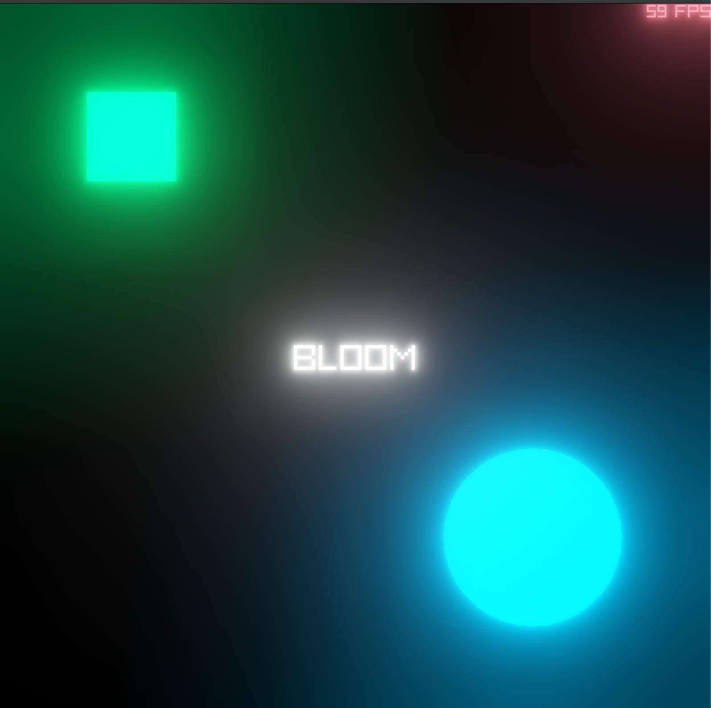

### [Algorithms by Jeff Erickson](https://jeffe.cs.illinois.edu/teaching/algorithms/)

1. **Quadtree**
Quadtree stands out as a pivotal data structure, especially in 2D game development. It excels at spatial partitioning, efficiently organizing and searching for objects in a hierarchical tree structure. This enhances critical aspects such as collision detection and rendering, contributing to smoother gameplay experiences.

2. **Octree**
Extending the concept of the quadtree into three-dimensional space, the octree is a crucial asset for 3D game development. It efficiently organizes and queries objects within a three-dimensional environment, proving indispensable for managing complex scenes and optimizing rendering processes.

  <a href="mcts/example/main.odin">
    3. Monte Carlo Tree Search
  </a>
  

4. **(A Star) Algorithm** 
A* is a versatile pathfinding algorithm that serves as the backbone for determining optimal paths between points in game environments. Its applications range from ensuring intelligent NPC movement to facilitating efficient player navigation, enhancing overall gameplay and user experience.

  

5. **Bloom**
[Next Generation Post Processing in Call of Duty](https://www.iryoku.com/next-generation-post-processing-in-call-of-duty-advanced-warfare/) by Jorge Jimenez introduced 
a type of [Physics Based Bloom](https://learnopengl.com/Guest-Articles/2022/Phys.-Based-Bloom) that is both computationally efficient and looks really good for most use-cases.

6. **Collision Detection Algorithms**
Various collision detection algorithms such as Separating Axis Theorem (SAT) and Gilbert–Johnson–Keerthi (GJK) are fundamental for realistic interactions between game entities. They are crucial for detecting and resolving collisions, ensuring accurate and engaging gameplay.