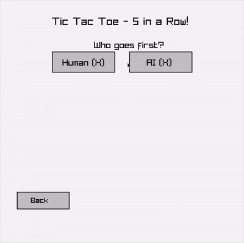

### Monte Carlo Tree Search

(MCTS) is a heuristic search algorithm used for decision making.
Combining the precision of tree search with the randomness of the Monte Carlo method to rank potential outcomes of different actions.

### Resources

- [Monte Carlo Tree Search](https://int8.io/monte-carlo-tree-search-beginners-guide/)  – beginner guide
- [The Animated MCTS](https://medium.com/towards-data-science/the-animated-monte-carlo-tree-search-mcts-c05bb48b018c) - the algorithm at the heart of AlphaGo

### What is it good for?

- **Versatility**: MCTS can be applied to a wide range of problems beyond games, including robotics, planning, and optimization.
- **Large State Spaces**: particularly effective in games with vast numbers of possible moves and outcomes, such as Go or Chess.
- **Uncertainty**: MCTS can handle uncertainty and incomplete information well, good for stochastic games with hidden information.
- **Real-Time Decision Making**: It can be used in real-time applications where decisions need to be made quickly, as it can run in limited time frames and still provide reasonable estimates of the best action.
- **Incremental Learning**: can improve performance over time as more data about the game is gathered.

### Limitations

- **Computational Resources**: can be resource-intensive, especially in complex games.
- **Exploration vs. Exploitation**: balancing (trying new moves) and exploitation (using known good moves) can be a challenge. Poor balancing = bad performance
- **Quality of Simulation**: effectiveness heavily relies on the quality of the simulations performed. If the simulation does not reflect the true game dynamic, then the result will be bad.
- **Not Always Optimal**: While MCTS can find good solutions, it does not guarantee optimality, especially in scenarios with a high branching factor or where the game tree is super deep.

### Example

  <a href="example/main.odin">
    TicTacToe
  </a>
  

### TODO: AI Improvements
- Prettify UI
- Adjust search depth based on gamestate progress.
- Value center positions higher during evaluation.