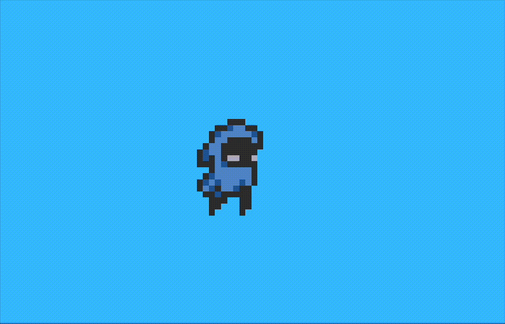
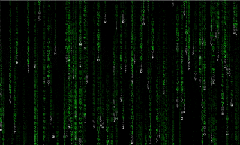
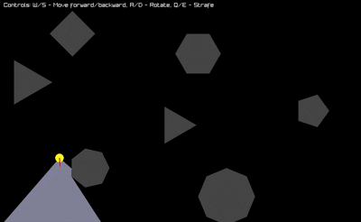
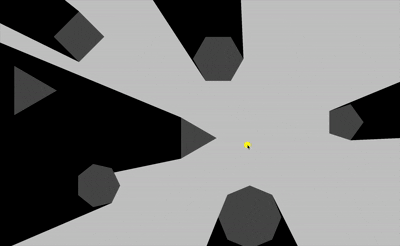

<h1 align="center">█▬▬𒄆 (◡̀_◡́)d𓌏nϟ 𒅒▬▬█</h1>

https://raw.githubusercontent.com/raysan5/raylib/master/logo/raylib_logo_animation.gif

  <a href="logo/main.odin">
    Raylib Logo
  </a>
  

  <a href="sprite/README.md">
    Sprites
  </a>
  

  <a href="matrix/basic/main.odin">
    The Matrix
  </a>
  

  <a href="terminator/main.odin">
    T-800
  </a>
  

  <a href="light/cone/main.odin">
    Cone Light
  </a>
  

  <a href="light/omni/main.odin">
    Omni Light
  </a>
  

