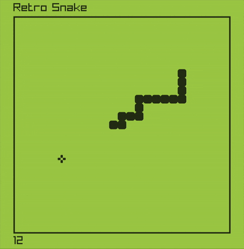

# Retro Snake game

Full source code for the notorious Snake game created with Odin using raylib.

  <a href="main.odin">
    Snake
  </a>
  

If you're interested in learning how to create your own snake game with raylib, then don't miss the <a href="https://youtu.be/LGqsnM_WEK4">Video Tutorial on YouTube</a>. The tutorial takes you through each line of code, explaining the logic and demonstrating how it affects the game. You'll learn how to set up the game window, create the snake and food classes, add collision detection, and implement sound effects. By the end of the tutorial, you'll have a fully functional snake game that you can play and modify to your heart's desire. So, grab a cup of coffee and get ready to dive into the exciting world of game development with raylib!

🎥 <a href="https://youtu.be/LGqsnM_WEK4">Video Tutorial on YouTube</a>

 
 

| 🌠<a href="http://www.programmingwithnick.com">Nick's Website</a> |  
| 📺 <a href="https://www.youtube.com/channel/UC3ivOTE5EgpmF2DHLBmWIWg">YouTube Channel</a>

