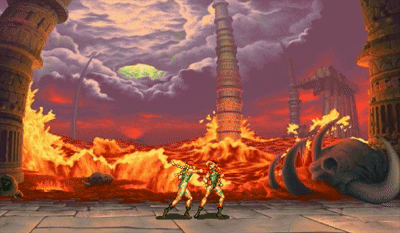

# Street Fighter 🥊 

  

## 🕹️ Done
  - Idle (Standing)
  - Walking
  - 3 types of punches (with responsive keyboard commands)
  
## 🎯 Todo
- Implement hitbox mechanics
- Add more Characters
  - [Ninja](https://www.spriters-resource.com/custom_edited/streetfightercustoms/sheet/187700/)
  - [Ryu](https://www.spriters-resource.com/custom_edited/streetfightercustoms/sheet/187703/)
  - [Cammy](https://www.spriters-resource.com/arcade/streetfighter2/sheet/117307/)
- Add more animations
  - **Kick** animations for both characters
  - **Hit** animations (when a character gets hit) for both
  - **Finisher** animations when the fight ends
- Damage mechanics, health bar, round system and victory conditions
- Add sound effects and visual effects
- Enemy AI
- https://github.com/victorberdugo1/RayPuppet-Animator
