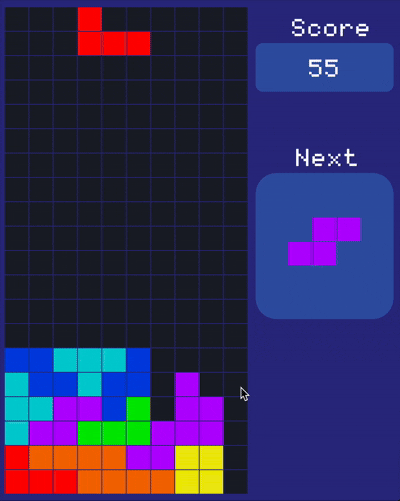

# C++ Tetris Game using raylib

Full source code for the infamous Tetris game built with the Odin programming language and raylib.

  

🎬 If you want to learn how to build your own Tetris game with raylib, check out the accompanying <a href="https://youtu.be/wVYKG_ch4yM">Video Tutorial on YouTube.</a> The tutorial guides you through every line of code, explaining the logic behind it and demonstrating how it affects the game.
By the end of the tutorial, you'll have a fully functional Tetris game that you can play and modify however you like. ☕ So, grab a cup of coffee and let's dive into the exciting world of game development with raylib! 🚀

🎥 <a href="https://youtu.be/wVYKG_ch4yM">Video Tutorial on YouTube</a>

 
 

| 🌍 <a href="http://www.programmingwithnick.com">Nick's Website</a>
| 📺 <a href="https://www.youtube.com/channel/UC3ivOTE5EgpmF2DHLBmWIWg">YouTube Channel</a> |  

