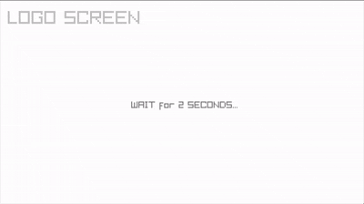
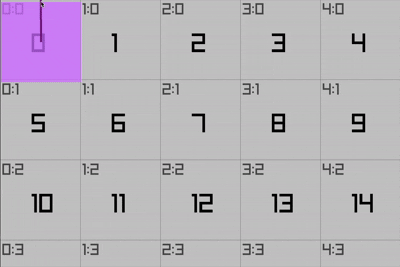
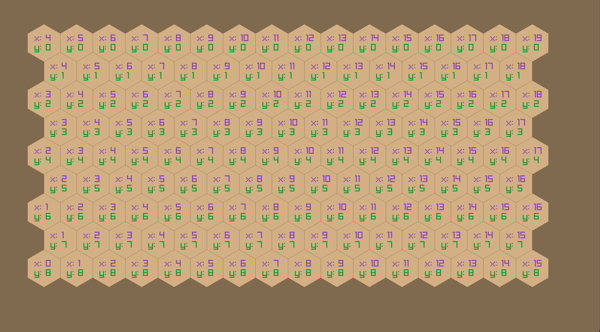
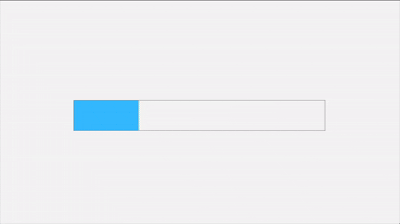
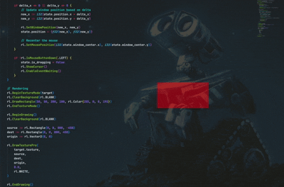

  <a href="microui/main.odin">
    MicroUI
  </a>
  

  <a href="screen/main.odin">
    Screens
  </a>
  

  <a href="buttons/main.odin">
    Buttons
  </a>
  

  <a href="grid/square/main.odin">
    Grid
  </a>
  

  <a href="grid/hex/main.odin">
    HexGrid
  </a>
  

- [Hexagonal Grids](https://www.redblobgames.com/grids/hexagons/)

- [Hex Grids and Cube Coordinates](https://backdrifting.net/post/064_hex_grids)

  <a href="thread/main.odin">
    Threading
  </a>
  

  <a href="drag/main.odin">
    Dragging Transparent Windows
  </a>
  

The centered cursor approach is commonly used in games for camera control and similar dragging operations because it provides such stable and reliable movement. It's particularly effective because:

1. We never run out of mouse space since we're always working from the center
2. The movement stays consistent regardless of window position on screen
3. There's no need to handle edge cases for when the mouse leaves the window
4. We get perfect 1:1 tracking of movement without any need for thresholds or smoothing

The invisible cursor during drag also makes it feel more like you're "grabbing" the window directly rather than dragging it with a cursor, which is a nice touch!

- [How Clay's UI Layout Algorithm Works](https://www.youtube.com/watch?v=by9lQvpvMIc)