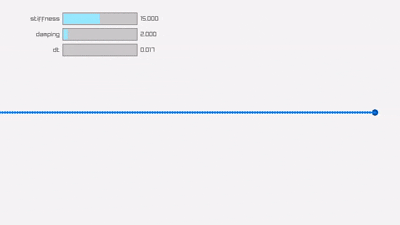

# Spring-It-On
## The Game Developer's Spring-Roll-Call
This repo contains the source code for all the demos from [this article](https://theorangeduck.com/page/spring-roll-call).

## [The Damper](damper/main.odin)

    <a href="damper/main.odin">
    The Damper
  </a>
    

    <a href="spring_damper/single/main.odin">
    The Spring Damper
  </a>
    

    <a href="controller/main.odin">
    Controller
  </a>
    

    <a href="inertialization/main.odin">
    Inertialization
  </a>
    

    <a href="interpolation/main.odin">
    Interpolation
  </a>
    

    <a href="resonance/main.odin">
    Resonance
  </a>
    

    <a href="extrapolation/main.odin">
    Extrapolation
  </a>
    

    <a href="spring_damper/double/main.odin">
    The Double Spring
  </a>
    

    <a href="timed_spring/main.odin">
    The Timed Spring
  </a>
    

    <a href="velocity_spring/main.odin">
    The Velocity Spring
  </a>
    

