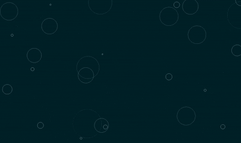
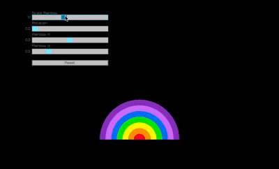
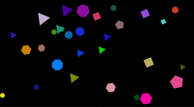

<h2 align="center">
    Curves
</h2>

  <a href="curves/ease/main.odin">
    Choose your poison
  </a>
  

  <a href="curves/smooth/main.odin">
    Bezier
  </a>
  

  <a href="triangle/example/main.odin">
    Triangles
  </a>
  

  <a href="dense/main.odin">
    Dense injections
  </a>
  

  <a href="circle/main.odin">
    Circles
  </a>
  

  <a href="drops/main.odin">
    Rain Drops
  </a>
  

  <a href="rainbow/main.odin">
    Rainbows
  </a>
  

  <a href="poly/main.odin">
    Polygons
  </a>
  

