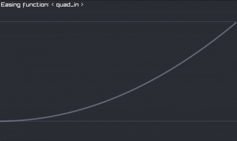
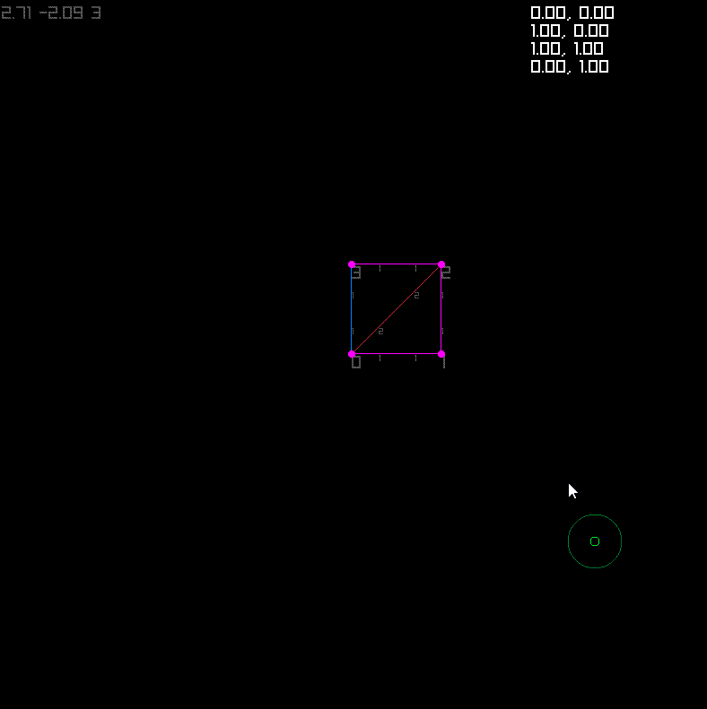
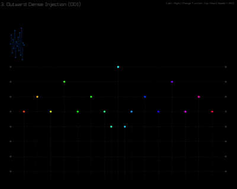
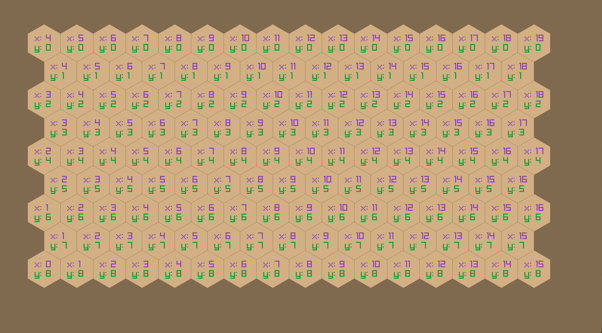

<h2 align="center">
    Curves
</h2>

  <a href="curves/ease/main.odin">
    Choose your poison
  </a>
  

  <a href="curves/smooth/main.odin">
    Bezier
  </a>
  

  <a href="triangle/example/main.odin">
    Triangles
  </a>
  

  <a href="dense/main.odin">
    Dense injections
  </a>
  

  <a href="hexgrid/main.odin">
    Hexgrid
  </a>
  

- [Hexagonal Grids](https://www.redblobgames.com/grids/hexagons/)

- [Hex Grids and Cube Coordinates](https://backdrifting.net/post/064_hex_grids)