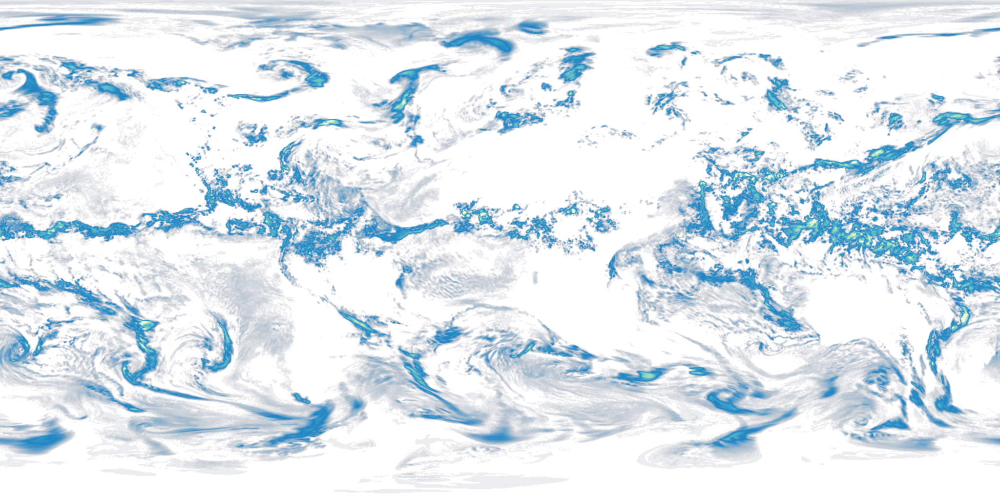
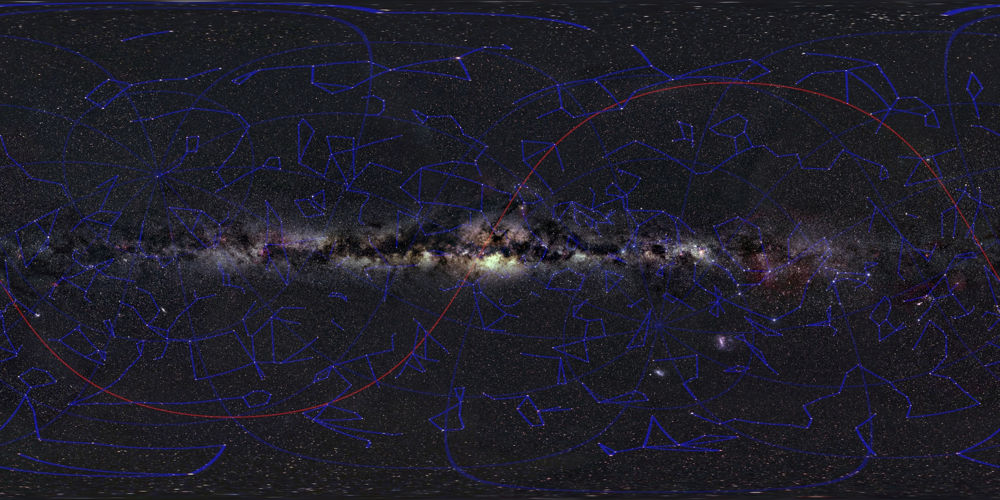

# Planet Simulator

C++ code ported from: https://github.com/vb8146649/PlanetSimulator_usingRaylib

Welcome to the **3D Model of Planets** project! This project generates a 3D model of planets using topographic features and textures, primarily focusing on Earth. The model allows for various customizations and simulations to create an accurate and dynamic representation of our beautiful planet.

<hr>
<p align="center">
  <a href="main.odin">
    
  </a>
</p>

## Features

- **Topographic and Texture Mapping**: Generates a 3D model of the planet using topographic data and textures.
- **Customizable Radius**: Adjust the radius of the planet model.
- **Mountain Prominence**: Make mountains pop by increasing their prominence.
- **Landmass Altitude**: Increase the altitude of all landmasses to differentiate from the sea.
- **Resolution Adjustment**: Change the resolution of the model for more detailed or simplified views.
- **Seasons Simulation**: Simulate seasons on the planet model.
- **Atmosphere and Clouds**: Add an atmosphere and clouds based on NASA satellite data.
- **Free Camera Mode**: View the model in a free camera mode for an immersive experience.
- **Real-time Simulation**: All changes and simulations happen in real-time.
- **Additional Datasets**: Includes hard-to-obtain datasets for trying out models of other planets.
- **Save 3d models**:Save the 3d model according to your preferences.

## Available Maps:







- **Venus** , **Saturn** ...

## TODO

- **Moon Simulation**: Simulate moons orbiting the planets.
- **Random Cloud Generator**: Add a feature to generate random cloud maps.

### Usage

- Use the controls to adjust the radius, mountain prominence, landmass altitude, and resolution.
- Toggle seasons and atmosphere to see the changes in real-time.
- Switch to free camera mode to explore the model from different angles.

## Changing File Location for Different Planets

To create models of other planets, you need to update the file locations in `main.cpp`. There are four variables corresponding to topography, texture, initial file location for clouds, and initial file location for seasons. 

1. **Open `main.odin`**:

2. **Update Variables**:
      ```odin
      topographymap :: "path/to/topography.png";
      texturemap :: "path/to/texture.png";
      cloudmaploc :: "path/to/clouds/cloud/";
      seasonsmaploc :: "path/to/seasons/season/";
      ```
    - Update these variables with the paths to your new planet data files. Ensure that the images for clouds and seasons are named in sequence (e.g., 1.png, 2.png) and use the correct file names to specify the ending and starting numbers.

3. **Ensure File Format**: 
    - Use only png file formats for image and texture.

4. **Ensure Numbered Filenames**:
    - Make sure that the image names for clouds and seasons are in numerical order. For example, `1.png`, `2.png`, etc. The program will use these numbers to load the correct files.

## Datasets

The repository includes various datasets for different planets. These datasets are rare and hard to obtain, providing an opportunity to explore and model other planets besides Earth.

## Contributing

If you have any suggestions or improvements, feel free to create an issue or submit a pull request. Contributions are welcome!

## Acknowledgements

- [raylib](https://www.raylib.com/)
- NASA

Hope you enjoy exploring and simulating planets!
