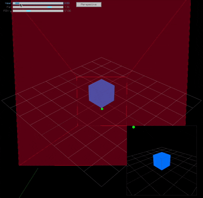

<h2 align="center">
Understanding camera projection
</h2>
<hr>
<p align="center">
  <a href="main.odin">
    
  </a>
</p>

Ported from: [github.com/arceryz/raylib-examples](https://github.com/arceryz/raylib-examples)

The green ray you're seeing bouncing of the cube at times is a visualization of a camera ray - essentially showing where in 3D space your mouse is "pointing" to from the camera's perspective.

1. code tracks mouse position and converts it to normalized device coordinates (NDC):
```odin
ndc := rl.Vector3{
    2 * mouse_pos.x / 800 - 1,
    -(2 * mouse_pos.y / 800 - 1),
    1,
}
```

2. It then uses `get_camera_world_ray` to convert the screen position into a 3D ray starting from the camera and extending into the scene:
```odin
line := get_camera_world_ray(ndc, view, proj)
rl.DrawLine3D(line.start, line.end, rl.GREEN)
```
This is a common technique in 3D graphics used for things like picking (determining what object the user is clicking on) or raycasting. The green line you see is literally showing you where in the 3D world your mouse is pointing from the camera's perspective.

In the rendered view, you'll see a small green circle following the mouse cursor, which corresponds to where this ray originates from in screen space.