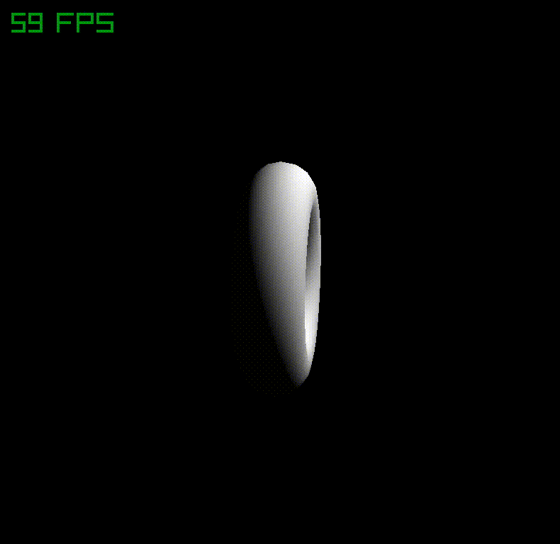
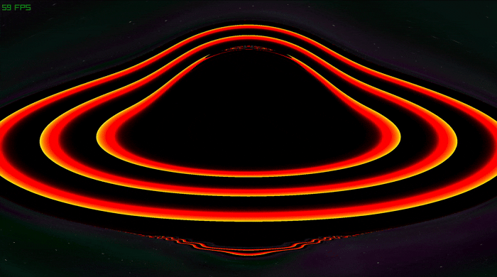
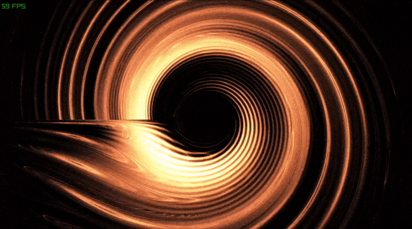
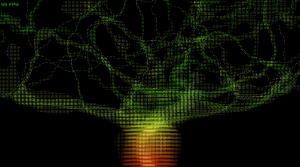
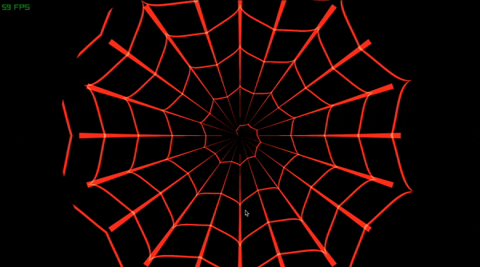
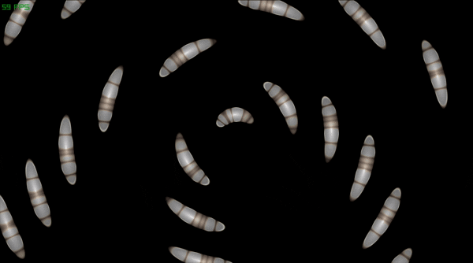

  <a href="https://sepi.prose.sh/2022-09-11-how-to-properly-use-shaders-in-raylib">
    🎨 Glsl shaders
  </a>
  

## Reference

- [Inigo Quilez](https://iquilezles.org/) ShaderKing

- [Glsl for Beginners](https://waelyasmina.net/articles/glsl-and-shaders-tutorial-for-beginners-webgl-threejs/)

- [YT How to Write Shaders](https://www.youtube.com/watch?v=7UvpTTEE1Hs&list=PLTJ_bWjv6i7xnDaPMrbx69zVu82sVails)

- [How to Write Shaders Code](https://github.com/SuboptimalEng/shader-tutorials)

- [OpenGL Tutorials](https://lazyfoo.net/tutorials/OpenGL/index.php)

- [Odin's OpenGL® tutorials](https://github.com/bg-thompson/OpenGL-Tutorials-In-Odin)

- [The Book of Shaders](https://thebookofshaders.com/)

- [The best darn shader yet](https://bgolus.medium.com/the-best-darn-grid-shader-yet-727f9278b9d8)

- [Shadered](https://shadered.org/) The most powerful shader IDE

- [Twigl](https://twigl.app/) Realtime in-browser shader IDE

### Let's port some more glsl examples ૮( OᴗO)っ Contributions welcome

- [Sirenian Dawn](https://www.shadertoy.com/view/XsyGWV)
- [Blue Planet](https://www.shadertoy.com/view/Ds3XRl)
- [flat planets](https://emildziewanowski.com/flat-planets/)

  <a href="shaderbox/assets/shader/black_hole.fs">
    Black Hole
  </a>
  

  <a href="shaderbox/assets/shader/white_hole.fs">
    White Hole
  </a>
  

  <a href="shaderbox/assets/shader/spiral.fs">
    Spiral
  </a>
  

  <a href="shaderbox/assets/shader/cloth.fs">
    Cloth
  </a>
  

  <a href="shaderbox/assets/shader/water_fire.fs">
    Water/Fire
  </a>
  

  <a href="shaderbox/assets/shader/ice_fire.fs">
    Ice/Fire
  </a>
  

  <a href="shaderbox/assets/shader/tree_ditter.fs">
   Tree Ditter
  </a>
  

  <a href="shaderbox/assets/shader/spider_web.fs">
   Spider Web
  </a>
  

  <a href="shaderbox/assets/shader/worms.fs">
   Worms
  </a>
  

