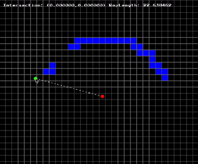
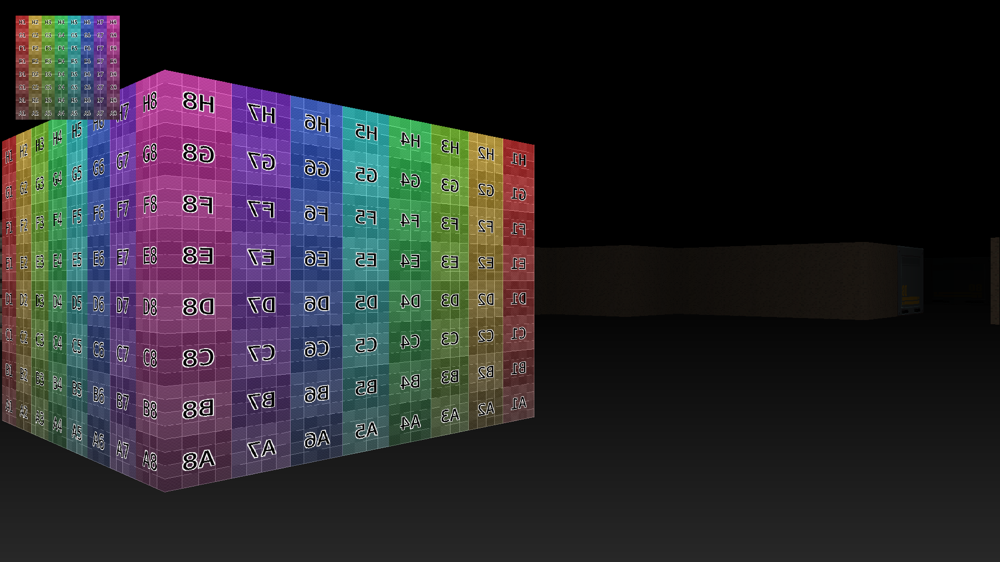

  <a href="dda/main.odin">
    DDA Raycaster
  </a>
  

- [Super Fast Ray Casting in Tiled Worlds using DDA by OneLoneCoder](https://www.youtube.com/watch?v=NbSee-XM7WA)
- [Making a RayCaster in Odin by Bachware](https://www.youtube.com/watch?v=9dLqxdbRjbM)
- [Alfie's - Odinary 3D DDA Raycaster](https://github.com/alfiehiscox/odinary-raycaster)

  <a href="https://github.com/thiagolopes/raycasting-wolfenstein-3d">
    Wolfenstein 3D
  </a>
  

