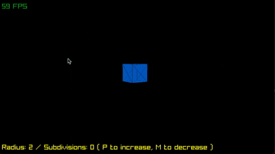

<h2 align="center">
    shapes
</h2>

  <a href="scale/main.odin">
    Scale
  </a>
  

  <a href="polygon/main.odin">
    Polygon
  </a>
  

  <a href="tesseract/main.odin">
    Tesseract
  </a>
  

  <a href="cubesphere/main.odin">
    Cubesphere
  </a>
  

  <a href="icosphere/main.odin">
    Icosphere
  </a>
  

  <a href="octsphere/main.odin">
    Octsphere
  </a>
  

  <a href="skybox/main.odin">
    Skybox
  </a>
  

