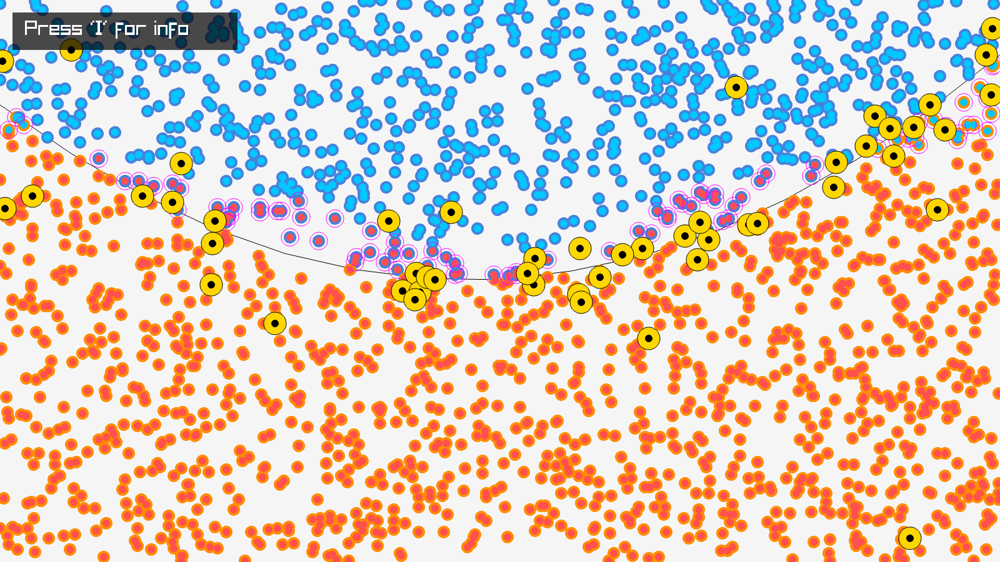
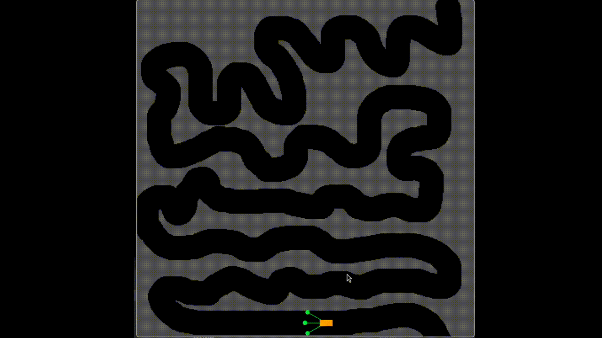
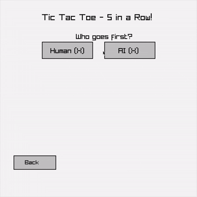
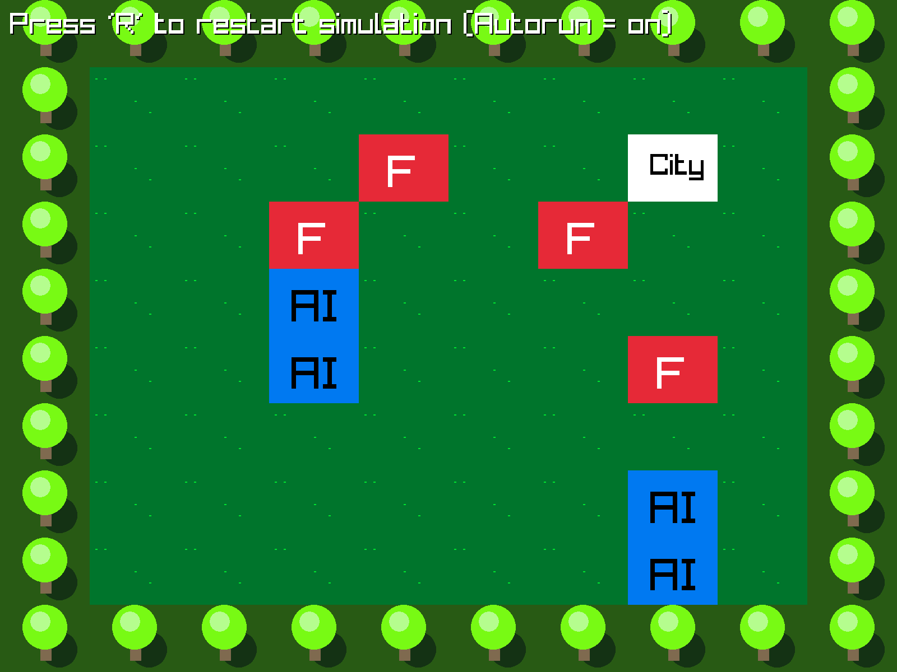

## [The Most Important Machine Learning Equations: A Comprehensive Guide](https://chizkidd.github.io//2025/05/30/machine-learning-key-math-eqns/)

- [How ML is transforming the Games Industry](http://youtube.com/watch?v=dm_yY-hddvE)

- [How DeepMind learns Physics](https://www.youtube.com/watch?v=2Bw5f4vYL98)

  <a href="perceptron/main.odin">
    Perceptron
  </a>
  

  <a href="drive/main.odin">
    Follow Line
  </a>
  

  <a href="fsm/demo/main.odin">
    Finite State Machine
  </a>
  

  <a href="minimax/main.odin">
    Minimax
  </a>
  

  <a href="mcts/demo/main.odin">
    Monte Carlo Tree Search
  </a>
  

  <a href="genetic/main.odin">
    Genetic Algo
  </a>
  

  <a href="qlearn/assets/main.odin">
    Q-Learn
  </a>
  

- [Q Learning Explained](https://www.youtube.com/watch?v=aCEvtRtNO-M)

- [Snake QLearn](https://github.com/Gualor/snake-rl)

- [Digit Learn](https://github.com/crismariudenis/NeuralNetworkCpp/blob/master/include/dataset.h)

- [TicTac](https://github.com/shahzebsiddiqui1990/NeuralNetworks_TicTacToe5x5x5/blob/master/tictactoenn/tt4.cpp)

## TODO:

- [MarkovJunior](https://github.com/mxgmn/MarkovJunior)
- [MarkovJuniorRaylib](https://github.com/derekmallon/MarkovJuniorRaylib)