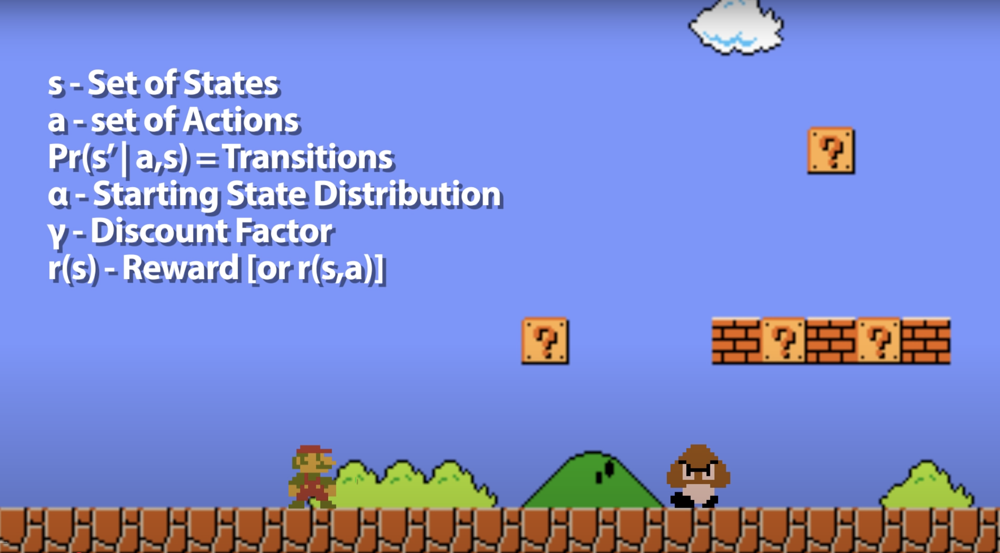
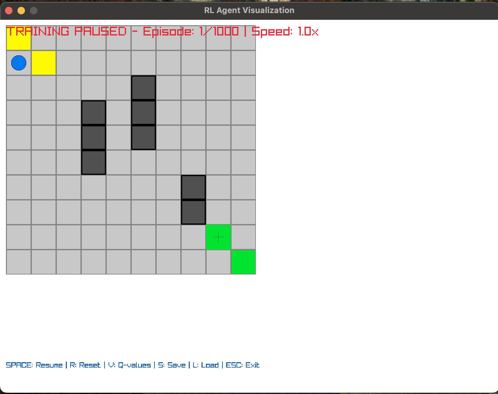
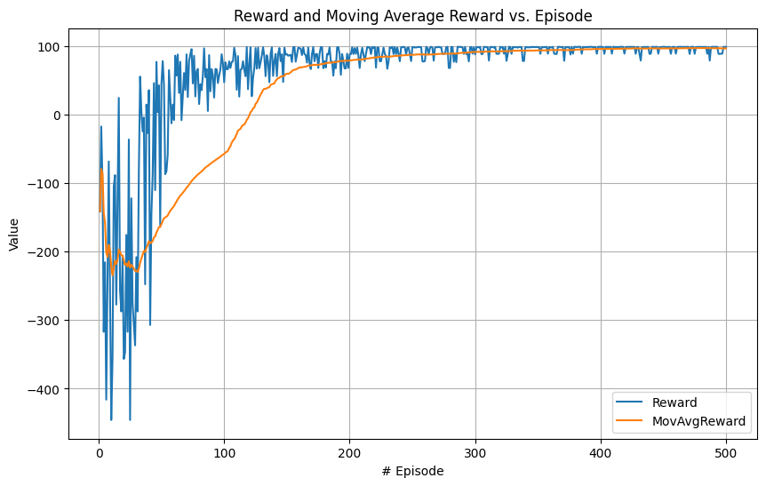

# `Q_Learner` the RL Grid SimDulation

High-performance real-time reinforcement learning simulation using strategy, experience replay and state visit prioritization on an optimized Q-table for efficient training in grid environments.


- [Q Learning Explained](https://www.youtube.com/watch?v=aCEvtRtNO-M)

The Q-agent learns to navigate a 10x10 grid from start(1,1) to finish(8,8) while avoiding any obstacle. 



### RL Engine
* **Q-Table**: Optimized temporal difference learning
* **SIMD** Accelerated operations for fast convergence
* **Q-Learning**: Temporal difference learning with configurable hyperparams
* **Priorities**: Tracks visit frequency to reward exploration
* **Epsilon-Greedy**: Exploration vs Exploitation strategy with adaptive decay
* **Experience Replay**: Stores and replays past experiences for stable learning progress

### Raylib
* **Real-Time Training**: Live visualization of learning progess
* **Heat Maps**: Visual representation of learned state
* **Agent Path Tracking**: Trail exploration patterns
* **Metrics**: Track reward, epsilon, and convergence metrics

## Metrics
The graph shows training performance over 500 epochs, demonstrating convergence to policy over time:



*reward progression, success rate, epsilon decay*

## Use

```bash
# Standard session
qlearn --epochs 500

# Quick eval
qlearn --epochs 100 --max-steps 200

# Interactive
qlearn --visualize --epochs 1000

# Custom config
qlearn --visualize --epochs 500 --max-steps 300 --policy my_policy.txt
```

### Options

| CMD | Description | Default |
|--------|-------------|---------|
| `--epochs N` | Number of training epochs | 1000 |
| `--max-steps N` | Maximum steps per epoch | 200 |
| `--visualize` | Enable real-time visualization | disabled |
| `--policy FILE` | Policy save filename | learned_policy.txt |
| `--no-save` | Disable automatic policy saving | false |
| `--quiet` | Suppress training output | false |

## Controls

| Key | Function | Description |
|-----|----------|-------------|
| **SPACE** | Pause/Resume | Toggle training execution |
| **R** | Reset | Complete training restart with fresh Q-table |
| **V** | Q-values | Toggle Q-value visualization overlay |
| **+/-** | Speed Control | Adjust training speed (0.1x to 10x) |
| **S/L** | Save/Load | Save or load Q-table state |
| **ESC** | Exit | Terminate training session |

## based on: https://github.com/jorgevee/Raylib-RL-Simulation

### Parameters Design (For Q-Learning)

*Four sets of parameters reflecting different human learning mindsets.*

| Agent Type   | Learning Rate (α) | Discount Factor (γ) | Exploration Rate (ε) | Strategy Focus                                 |
|--------------|-------------------|----------------------|-----------------------|------------------------------------------------|
| Quick Learner| 0.95              | 0.1                  | 0.2                   | Adapt quickly to gain instant rewards          |
| Explorer     | 0.7               | 0.5                  | 0.5                   | Explore more, learn more states                |
| Conservative | 0.5               | 0.6                  | 0.1                   | Slow learning with long-term priority          |
| Strategist   | 0.6               | 0.8                  | 0.3                   | Explore with long-term priority                |


## TODO apply to pacman:
qlearn racing: https://github.com/Gabfuwak/RL-Racing/tree/e125404722e4b2ad8481d505a2c913712b4b67a8
pacman: https://rlproject.netlify.app/
https://github.com/Sadmanaster/Reinforcement-Learning-in-Game-Development/tree/main

States and Features
States (For Q-Learning)
Layout Information
Walls
Maze Width and Height
Food Information
Food dot locations
Power pellet locations
Agent Information
Pacman's position and direction
Ghost positions and directions
Ghost scared timer states
Whether agents are eaten
Game Information
Win/Loss state
Features Extraction (For Approximate Q-Learning)
Closest Food: Normalized distance to the closest food pellet.
Number of ghosts 1 step away
Food Eaten: 1 when agent eats food and no ghosts are nearby