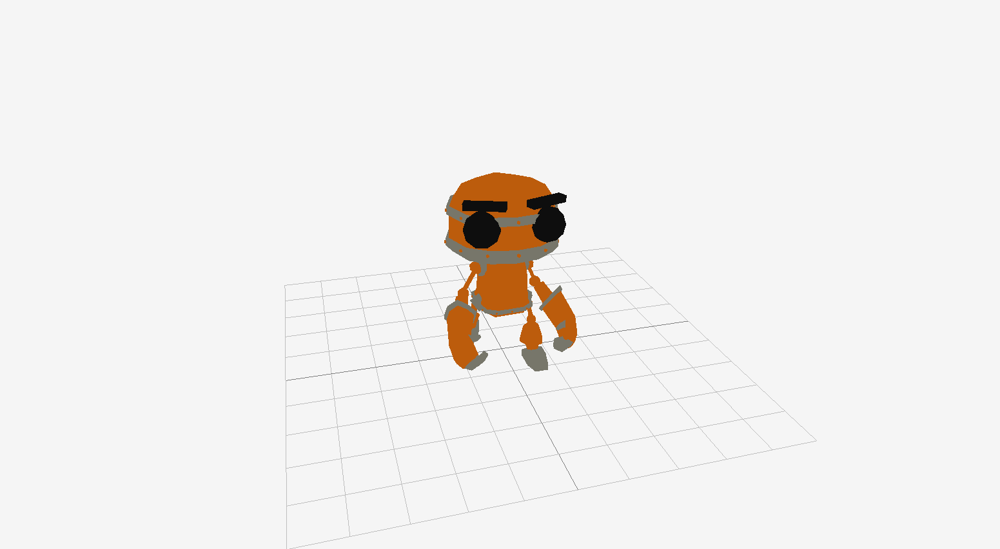

<h1 align="center">█▬▬𒄆 (◡̀_◡́)d𓌏nϟ 𒅒▬▬█</h1>
<h2 align="center">𓂀aᛉlib 🔆</h2>

and Odin bespoke unto thee: " Mortals ⚡ let's plunge y'a into the exciting world of game development, for I bestow upon thee Odin's tongue, to render worlds crisp and beautiful as Freya's hall, handling physics steady as Mjolnir's flight. No more shall y'a wrestle with the serpents of lake memory or the Garm of undefined behavior! Rise now, and build thy games, forge thy digital realm with the strength of Asgard, for Odin's language bears the blessing of both low-level mastery and high-level grace...💥"

## [𓂀aᛉlib 🔆 basics by Falconerd in Odin](https://github.com/Falconerd/raylib_introduction/blob/master/main.odin)
 1. Create a Window
 2. Draw Simple Shapes
 3. Handle Input
 4. Loading and Drawing Textures
 5. Basic animation
 6. Playing sound
 7. Text rendering
 8. Basic collision detection
 9. Using the camera (2D)
 10. Render Textures, Post Processing Shaders

## 𓂀aᛉlib 🔆 examples ported to Odin

Paralax Scrolling
  

Sprite rendering
  

Explosions
  

Animations
  

Gltf models
  

  
  <h2>Programming With Nick
  (lessons ported from C++)</h2>

Collision detection
  

Menus
  

Analog Clock
  

[Nick's 𓂀aᛉlib 🔆 Tutorial Series on Youtube](https://www.youtube.com/watch?v=wVYKG_ch4yM&list=PLwR6ZGPvjVOSRywn9VCQ3yrRVruxzzuo9)

Voxel space

https://github.com/djmgit/voxel_space/assets/16368427/20eb69ed-96bf-4ddb-a4a2-85214f3da049

# Resources

- [Computer Graphics from scratch](https://gabrielgambetta.com/computer-graphics-from-scratch/index.html)

- [Real Time Collision Detection](https://gist.github.com/jakubtomsu/2acd84731d3c2613c91e40c2e064ffe6)

- [OpenAl - 3d Audio](https://github.com/elvodqa/odin-al/blob/master/openal.odin)

- [𓂀aᛉlib Todo App](https://github.com/scheinheiser/todo-app)

- [ZTME - 𓂀aᛉlib Tile Editor](https://github.com/Z7-Z7L/ZTME)

- [Anima - 2D animations](https://github.com/atomicptr/anima)

- [Odin's Aseprite](https://github.com/blob1807/odin-aseprite)

- [Lobster asset packs](https://o-lobster.itch.io/)

- [Dusk game engine](https://github.com/JerMakesStuff/Dusk)

- [A*2D path finding](https://github.com/scoobery/odin_pathgrid/blob/master/README.md)

- [glTF2](https://github.com/Pawel82S/glTF2)

- [Assimp](https://github.com/CoolDove/odin-assimp/tree/master)

𒉭 𐱅𐰇𐰼𐰰 𖣐
