<h1 align="center">█▬▬𒄆 (◡̀_◡́)d𓌏nϟ 𒅒▬▬█</h1>
<h2 align="center">𓂀aᛉlib 🔆 (125+ examples and counting)</h2>

and Odin bespoke unto thee: " Mortals ⚡ let's plunge y'a into the exciting world of game development, for I bestow upon thee Odin's tongue, to render worlds crisp and beautiful as Freyja's hall, handling physics steady as Mjölnir's flight. No more shall y'a wrestle with the serpents of lake memory or the Garm of undefined behavior! Rise now, and build thy games, forge thy digital realm with the strength of Asgard, for Odin's language bears the blessing of both low-level mastery and high-level grace...💥"

  <a href="https://gabrielgambetta.com/computer-graphics-from-scratch/index.html">
    Computer Graphics from scratch - Gabriel Gambetta
  </a>
  

  <a href="https://www.youtube.com/watch?v=UoAsDlUwjy0">
    The ultimate introduction to 𓂀aᛉlib
  </a>
  <a href="3D/astro/shooter/main.odin">
    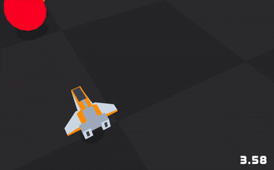
  </a>

- [Game Programming Patterns](https://gameprogrammingpatterns.com/contents.html)
- [Ashish's intro to 𓂀aᛉlib](https://github.com/AshishAanand/Raylib/blob/master/Raylib.md)
- [𓂀aᛉlib Todo App](https://github.com/scheinheiser/todo-app)
- [𓂀aᛉlib 🔆 v5.5 cheat sheet](https://www.raylib.com/cheatsheet/cheatsheet.html)
- [Building and Linking Google's ANGLE with 𓂀aᛉlib 🔆 on MacOS](https://dev.to/grplyler/building-and-linking-googles-angle-with-raylib-on-macos-11kp) todo dedicated ODIN guide

## 𓂀aᛉlib 🔆 2D

  <a href="2D/anim/matrix/basic/main.odin">
    The Matrix
  </a>
  <a href="2D/anim/matrix/basic/main.odin">
    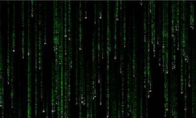
  </a>

  <a href="2D/gui/microui/main.odin">
    MicroUI
  </a>
  

  <a href="2D/camera/paralax/scroll.odin">
    Paralax
  </a>
  

  <a href="https://x.com/DetFantasia/status/1810374059559104603">
    Detective Fantasia Technique
  </a>

  <a href="2D/anim/sprite/README.md">
    Animator
  </a>
  

  <a href="2D/anim/sprite/README.md">
    Explosions
  </a>
  <a href="2D/anim/sprite/README.md">
    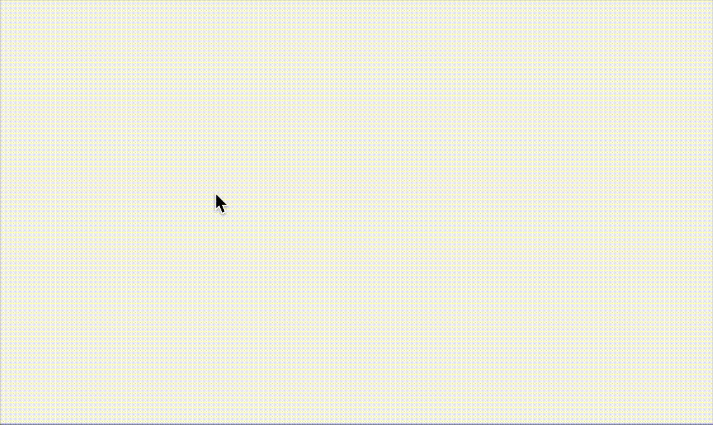
  </a>

  <a href="2D/anim/sprite/README.md">
    Character Control
  </a>
  <a href="2D/anim/sprite/README.md">
    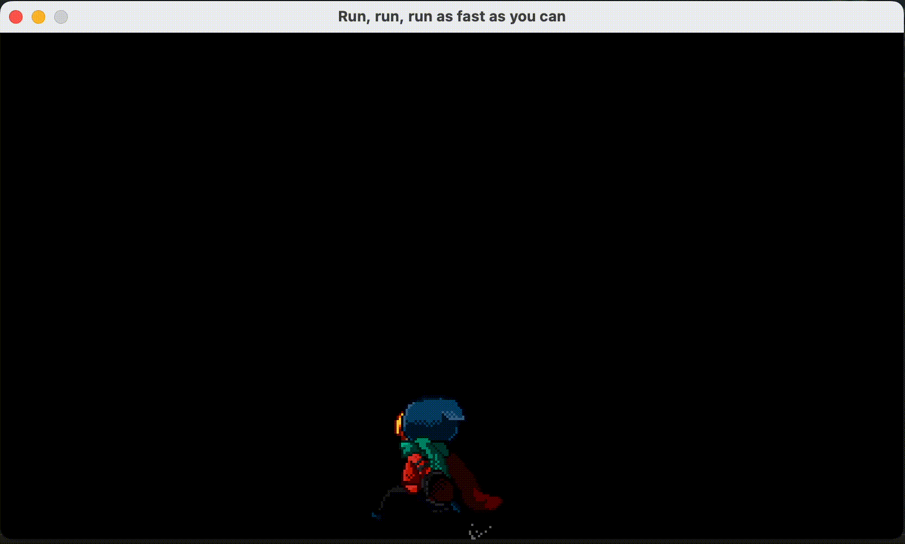
  </a>

  <a href="2D/physics/collision/README.md">
    Sort, sweep and prune
  </a>
  <a href="2D/physics/collision/README.md">
    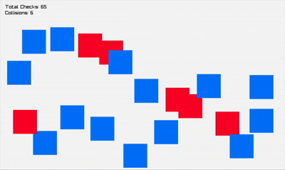
  </a>

  <a href="2D/camera/control/main.odin">
    Camera Control
  </a>
  <a href="2D/camera/control/main.odin">
    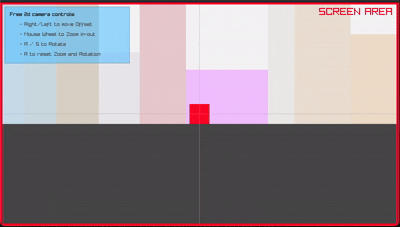
  </a>

[Understanding the 2D Camera in Raylib](http://archieatkinson.com/raylib-2dcamera)

  <a href="2D/camera/quadtree/main.odin">
    Quadtree
  </a>
  <a href="2D/camera/quadtree/main.odin">
    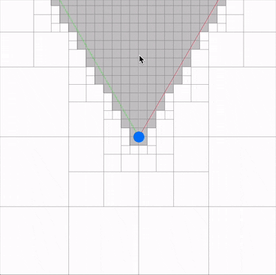
  </a>

  <a href="audio/timesteps/README.md">
    Fixed Timesteps
  </a>
  

  <a href="2D/shapes/README.md">
    Shapes
  </a>
  <a href="2D/shapes/README.md">
    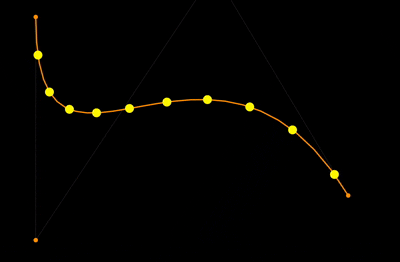
  </a>

  <a href="2D/physics/bounce/main.odin">
    Bounce
  </a>
  <a href="2D/physics/bounce/main.odin">
    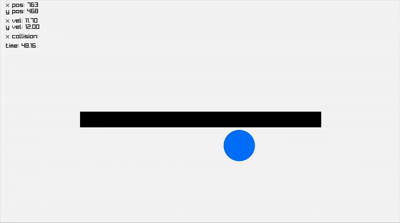
  </a>

  <a href="2D/physics/springs/README.md">
    Springs
  </a>
    <a href="2D/physics/springs/README.md">
    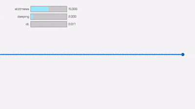
  </a>

  <a href="2D/physics/fire/README.md">
    DOOM fire effect
  </a>
  

  <a href="2D/physics/fluid/main.odin">
    Fluid Simulation
  </a>
  <a href="2D/physics/fluid/main.odin">
    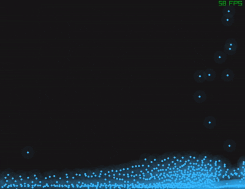
  </a>

  <a href="2D/algos/voronoi/map/main.odin">
    Voronoi Cells
  </a>
  <a href="2D/algos/voronoi/map/main.odin">
    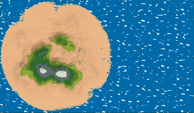
  </a>

  <a href="2D/algos/wave/main.odin">
    Wave Function Collapse
  </a>
  <a href="2D/algos/wave/main.odin">
    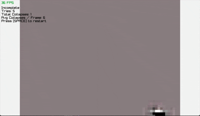
  </a>

  <a href="https://github.com/jmarron7/odin-boids/blob/main/src/main.odin">
    Boids Algorithm
  </a>
  

  <a href="2D/algos/astar/README.md">
    Dijkstra's A* Path finder
  </a>
  <a href="2D/algos/astar/README.md">
    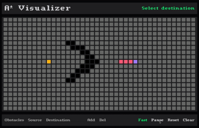
  </a>

  <a href="2D/algos/tsp/README.md">
    Ant Colonies / Travelling Salesman
  </a>
  <a href="2D/algos/tsp/README.md">
    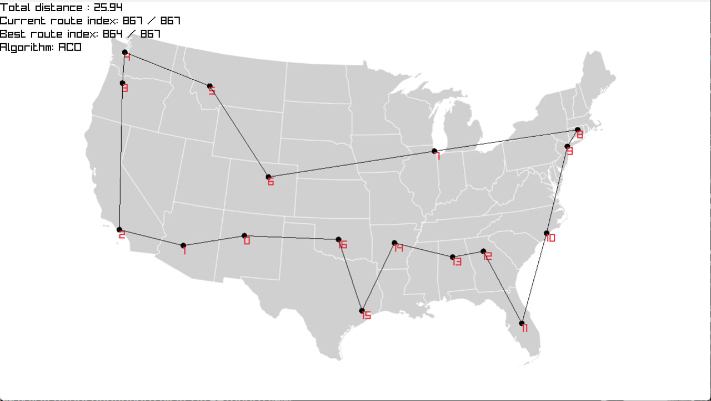
  </a>

  <a href="2D/games/asteroids/main.odin">
    In a world filled with space rocks, one ship can make a difference...
  </a>
  

  

  <a href="2D/games/racing/main.odin">
    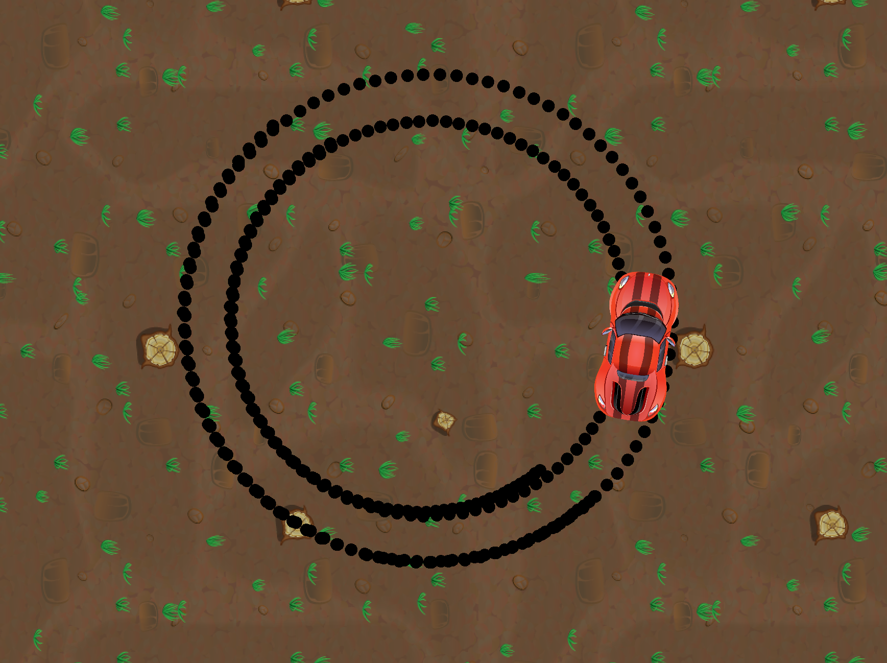
  </a>

  

  <a href="2D/gui/buttons/button.odin">
    Menus
  </a>
  

  <a href="2D/gui/clock/analog/main.odin">
    Analog Clock
  </a>
  

  <a href="2D/games/pong/main.odin">
    Pong
  </a>
  <a href="2D/games/pong/main.odin">
    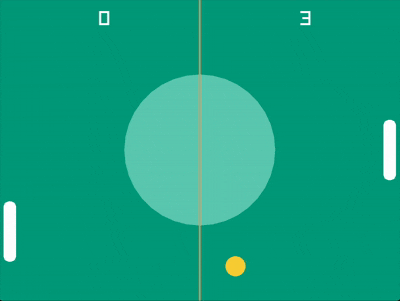
  </a>

  <a href="2D/games/snake/README.md">
    Snake
  </a>
  <a href="2D/games/snake/README.md">
    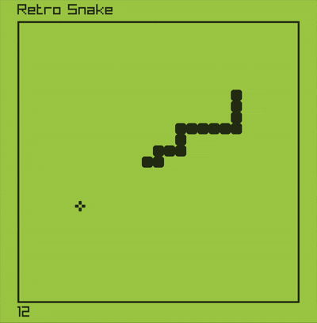
  </a>

  <a href="https://en.wikipedia.org/wiki/Conway's_Game_of_Life">
    Conway's Game of Life
  </a>
  <a href="2D/games/conway/main.odin">
    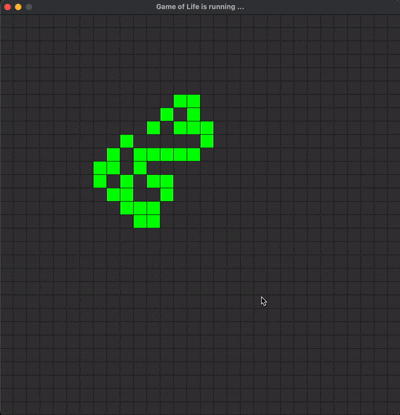
  </a>

  <a href="2D/games/tetris/README.md">
    Tetris
  </a>
  <a href="2D/games/tetris/README.md">
    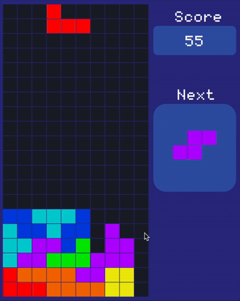
  </a>

  <a href="2D/games/chess/play/main.odin">
    Chess
  </a>
  <a href="2D/games/chess/play/main.odin">
    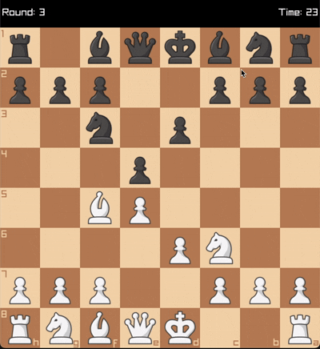
  </a>

  <a href="2D/games/life/main.odin">
    Life From Simple Rules
  </a>
  <a href="2D/games/life/main.odin">
    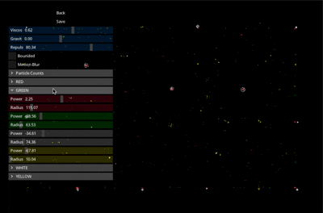
  </a>

  <h2>𓂀aᛉlib 🔆 3D </h2>

  to the stars...
  <a href="3D/astro/stars/main.odin">
    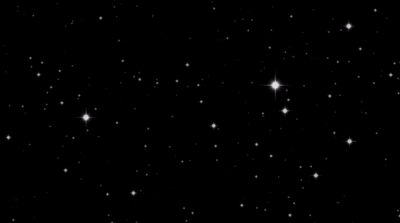
  </a>

  <a href="3D/shapes/README.md">
    Exotic shapes
  </a>
  <a href="3D/shapes/README.md">
    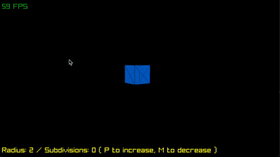
  </a>

  <a href="3D/astro/planets/README.md">
    Planets
  </a>
  

  <a href="3D/camera/frustum/README.md">
    Frustum
  </a>
  <a href="3D/camera/frustum/README.md">
    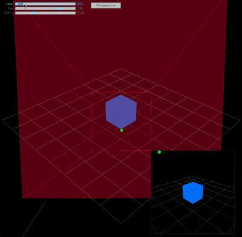
  </a>

  <a href="3D/camera/blender/README.md">
    Blender style
  </a>
  <a href="3D/camera/blender/README.md">
    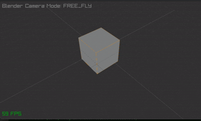
  </a>

  <a href="3D/maps/height/main.odin">
    Height maps
  </a>
  <a href="3D/maps/height/main.odin">
    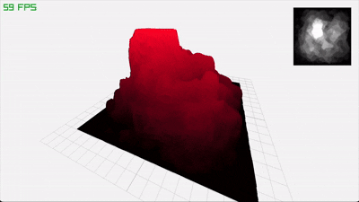
  </a>

  <a href="3D/rotation/main.odin">
    Flight control
  </a>
  <a href="3D/rotation/main.odin">
    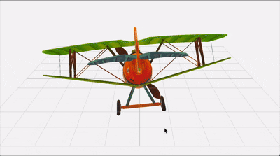
  </a>

  <a href="https://github.com/heyoeyo/jetslalom_odin">
    Jetslalom
  </a>
  

## Physics ૮( OᴗO)っ Contributions welcome

  <a href="3D/physics/collision/box/main.odin">
    Collision detection
  </a>
  <a href="3D/physics/collision/box/main.odin">
    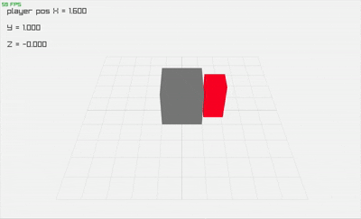
  </a>

  <a href="3D/physics/perlin/main.odin">
    Perlin noise
  </a>
  <a href="3D/physics/perlin/main.odin">
    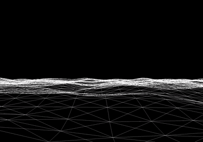
  </a>

- [Jolt](3D/jolt/jolt.odin) C Bindings to Jolt
- [PhysX](https://github.com/tgolsson/physx-odin) C Bindings to PhysX

## OpenGL®
Originally developed by Silicon Graphics in the early '90s, OpenGL® has become the most widely-used open graphics standard in the world

  <a href="3D/models/glb/robot/main.odin">
    GLB models
  </a>
  <a href=3D/models/glb/robot/main.odin">
    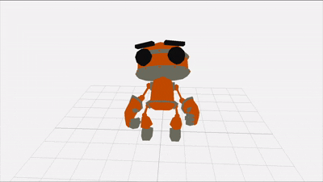
  </a>

  <a href="3D/models/obj/main.odin">
    OBJ models
  </a>
  <a href="3D/models/obj/main.odin">
    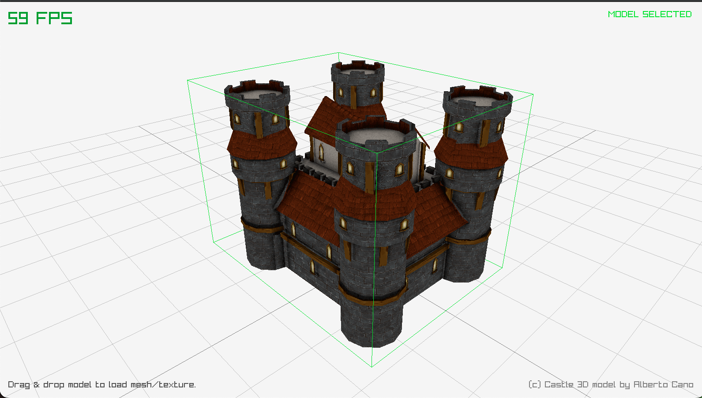
  </a>

  <a href="3D/glsl/README.md">
    Glsl shaders
  </a>
  

  <a href="3D/glsl/instancing/main.odin">
    Gpu Instancing
  </a>
  <a href="3D/glsl/instancing/main.odin">
    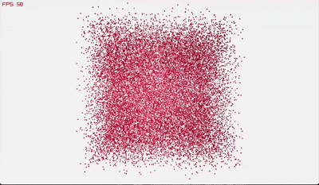
  </a>

  <a href="3D/physics/pbr/main.odin">
    Physics Based Rendering (PBR)
  </a>
  <a href="3D/physics/pbr/main.odin">
    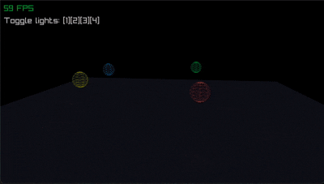
  </a>

  <a href="3D/ray/casting/README.md">
    Raycasting
  </a>
  <a href="3D/ray/casting/README.md">
    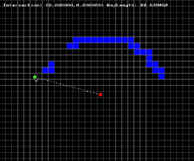
  </a>

  <a href="3D/ray/marching/README.md">
    Raymarching
  </a>
  <a href="3D/ray/marching/README.md">
    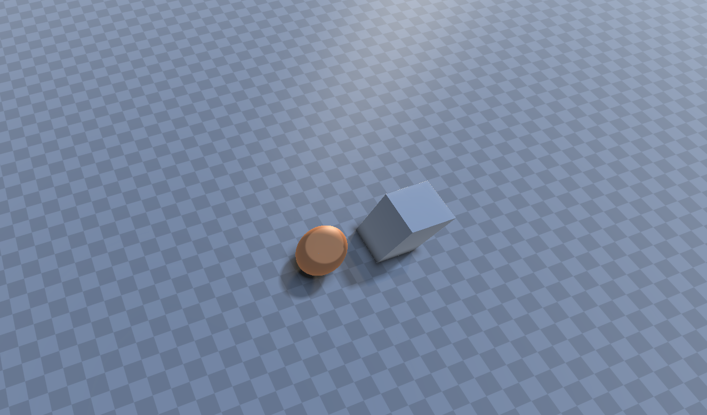
  </a>

<!-- 

  <a href="3D/ray/tracing/README.md">
    Raytracing
  </a>
  

 -->

  <a href="3D/voxels/README.md">
    Voxels
  </a>
  

## (◡̀_◡́)d𓌏nϟ Hall of FAME

- [Graphics Programmer Weekly](https://www.jendrikillner.com/article_database/)
- [Sorting Visualizer](https://github.com/wmpowell8/RaylibSortingVisualizer)
- [Orbitz](https://github.com/quonic/Odin-Orbitz)
- [Neural network visualizer](https://github.com/bones-ai/odin-mnist-nn) written from scratch in Odin and 𓂀aᛉlib.

### Gamez

- [PacMan](https://github.com/uewekenuewe/10games/blob/main/pacman/pacman.odin) The classic

- [Isometric PacMan](https://github.com/tancetiner/Isometric-Pacman)

- [YT 2048](https://www.youtube.com/watch?v=jACE6KsLbyA)

- [OdinGame](https://github.com/BeauRussell/OdinGame/blob/main/main.odin) Cool & Easy Physics

- [BubbleSort](https://github.com/Goldenlion5648/BubbleSortGame)

- [MineSweeper](https://github.com/Nave55/Odin-Raylib-Examples/blob/main/Games/Minesweeper/minesweeper.odin)

- [Wordle](https://github.com/aribish/spurtle)

- [Zelda](https://github.com/travis-racisz/zelda-clone/blob/master/zelda-clone)

- [Samurai](https://github.com/Spyder01/samurai-game)

- [Space Invaders](https://github.com/JESSE-SOTERIA/Invaders)

- [Archery](https://github.com/LunaStrawberri/archery)

- [Wolfenstein 3D](https://github.com/Akselmo/artificial-rage)

- [Quake](https://github.com/jakubtomsu/dungeon-of-quake?tab=readme-ov-file)

- [Chunky](https://github.com/christopherzimmerman/chunky) Minecraft-inspired voxel game

- [Solitaire](https://github.com/mawaldne/solitrouble)

- [Super Mario](https://github.com/jfcode4/mario)

- [Billiard](https://github.com/parodyband/odin-billiards)

### Toolz

- [Spall](https://github.com/colrdavidson/spall-web) profiler

- [Echo 3D](https://www.echo3d.com/post/convert-2d-and-3d-assets-for-free-tutorial) Convert 2D and 3D Assets

- [Hunyuan3D NeuralNet](https://huggingface.co/tencent/Hunyuan3D-2) Image to 3D model

- [Magic Poser](https://magicposer.com/) Draw better and faster

- [Piskel](https://www.piskelapp.com/) Editor for animated sprites & pixel art.

- [Dimensions](https://www.dimensions.com/) visual references of scale across objects.

- [glTF Viewer](https://gltf-viewer.donmccurdy.com/)

- [Cascadeur: 3D model animator](https://cascadeur.com/)

- [ZTME](https://github.com/Z7-Z7L/ZTME) 𓂀aᛉlib Tile Editor

- [TMX](https://github.com/RobLoach/raylib-tmx) Load Tiled .tmx files for tile maps in 𓂀aᛉlib, with TMX C Loader.

- [CrocoTile 3D](https://crocotile3d.com/) Create 3d models and environments with tiles.

### Assets

- [Free Icons](https://feathericons.com/)

- [Monospace Fonts](https://freebiesupply.com/blog/top-monospace-fonts-for-developers/)

- [Canva color wheel](https://www.canva.com/colors/color-wheel/)

- [Freepik](https://www.freepik.com/) Designers’ faves

- [Pixilart](https://www.pixilart.com/) Create and share art.

-	[OpenGameArt](https://opengameart.org/): A treasure trove of open-source game assets.

-	[Kenney.nl](https://kenney.nl/assets): Free game assets for 2D and 3D projects.

-	[kaylousberg](https://kaylousberg.com/game-assets): Great collection of free game assets.

-	[Quaternius](https://quaternius.com/): Free low-poly 3D models.

-	[PolyPizza](https://poly.pizza/): perfect for game jams.

- [Polyhaven](https://polyhaven.com/): Free HDRI Environment Maps.

- [Jeremie's 3K animals](https://sketchfab.com/jeremielouvetz/collections/3k-animals) Free low-poly animal models.

- [Textures.com](https://www.textures.com/) Take your CG art to the next level.

- [Transparent Textures](https://www.transparenttextures.com/)

- [Jangafx - Embergen](https://jangafx.com/software/embergen/download/free-vdb-animations/) Free VDB Animations.

### Templates

- [Dusk's 𓂀aᛉlib game template](https://github.com/JerMakesStuff/Dusk)

- [Karl's 𓂀aᛉlib game template with Hot Reload](https://github.com/karl-zylinski/odin-raylib-hot-reload-game-template)

- [Raylib and ImGui](https://github.com/Georgefwm/raylib-imgui-odin-template/blob/main/README.md)

## Audio

- [YT Coding Adventure by Sebastian Lague](https://www.youtube.com/watch?v=iA6wRgwl7k0) Sound (and the Fourier Transform)

- [FFTW](https://github.com/joaocarvalhoopen/FFTW_lib_bindings_for_Odin) C Bindings to compute discrete Fourier transform in one or more dimensions.

- [OpenAl - 3d Audio](https://github.com/elvodqa/odin-al/blob/master/openal.odin) C Bindings

- [99sounds](https://99sounds.org/free-sound-effects/)

- [FreeSound.org](https://freesound.org/) collaborative collection of ~700K free sounds

- [Free to Use Sounds](http://freetousesounds.com/) Sounds from around the world!

- [BBC Sound Effects](https://sound-effects.bbcrewind.co.uk/) 33K free sounds from the BBC Effects archive

## [Contribute](contributing.md)
Enter thy hall, where mortals become legends and etch your legacy into the fabric of [Yggdrasil](https://en.wikipedia.org/wiki/Yggdrasil) itself

𒉭 𐱅𐰇𐰼𐰰 𖣐

