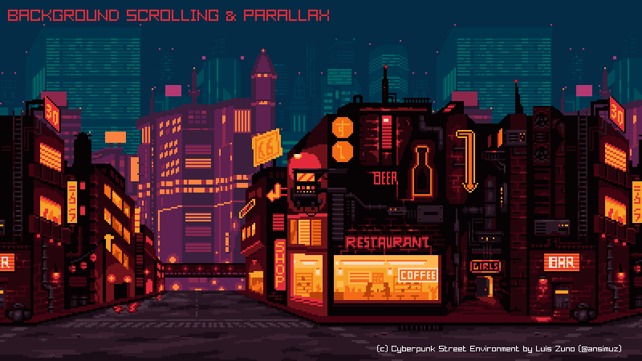
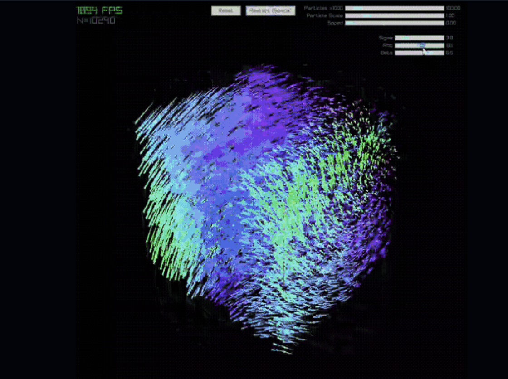

<h1 align="center">█▬▬𒄆 (◡̀_◡́)d𓌏nϟ 𒅒▬▬█</h1>
<h2 align="center">𓂀aᛉlib 🔆</h2>

and Odin bespoke unto thee: " Mortals ⚡ let's plunge y'a into the exciting world of game development, for I bestow upon thee Odin's tongue, to render worlds crisp and beautiful as Freya's hall, handling physics steady as Mjolnir's flight. No more shall y'a wrestle with the serpents of lake memory or the Garm of undefined behavior! Rise now, and build thy games, forge thy digital realm with the strength of Asgard, for Odin's language bears the blessing of both low-level mastery and high-level grace...💥"

## [𓂀aᛉlib 🔆 basics by Falconerd](https://github.com/Falconerd/raylib_introduction/blob/master/main.odin)
 1. Create a Window
 2. Draw Simple Shapes
 3. Handle Input
 4. Loading and Drawing Textures
 5. Basic animation
 6. Playing sound
 7. Text rendering
 8. Basic collision detection
 9. Using the camera (2D)
 10. Render Textures, Post Processing Shaders

  <a href="2D/microui/main.odin">
    MicroUI
  </a>
  

## 𓂀aᛉlib 🔆 2D

  <a href="2D/scroll/scroll.odin">
    Paralax Scrolling
  </a>
  

  <a href="2D/sprite/sprite.odin">
    Sprite rendering
  </a>
  

  <a href="2D/explosion/explosion.odin">
    Explosions
  </a>
  

  <a href="2D/animations/anime.odin">
    Animations
  </a>
  

  
  <h2>Programming With Nick
  (lessons ported from C++)</h2>

  <a href="2D/collision/dino.odin">
    Collision detection
  </a>
  

  <a href="2D/buttons/button.odin">
    Menus
  </a>
  

  <a href="2D/clock/clockn.odin">
    Analog Clock
  </a>
  

[Nick's 𓂀aᛉlib 🔆 Tutorial Series on Youtube](https://www.youtube.com/watch?v=wVYKG_ch4yM&list=PLwR6ZGPvjVOSRywn9VCQ3yrRVruxzzuo9)

  

## 𓂀aᛉlib 🔆 3D

  <a href="3D/gltf/gltf.odin">
    Gltf models
  </a>
  

  <a href="3D/glsl/main.odin">
    Glsl shaders
  </a>
  

  <a href="3D/raymarching/main.odin">
    Raymarching
  </a>
  

  <a href="3D/voxels/README.md">
    Voxel space
  </a>

https://github.com/djmgit/voxel_space/assets/16368427/20eb69ed-96bf-4ddb-a4a2-85214f3da049

  <a href="3D/particles/main.odin">
    Particle simulation
  </a>
  

# Resources

## Basics 

- [Computer Graphics from scratch](https://gabrielgambetta.com/computer-graphics-from-scratch/index.html)

- [𓂀aᛉlib Todo App](https://github.com/scheinheiser/todo-app)

- [Dusk's 𓂀aᛉlib game template](https://github.com/JerMakesStuff/Dusk)

- [Karl's 𓂀aᛉlib game template with Hot Reload](https://github.com/karl-zylinski/odin-raylib-hot-reload-game-template)

## Sound

- [OpenAl - 3d Audio](https://github.com/elvodqa/odin-al/blob/master/openal.odin)

- [FreeSound.org](https://freesound.org/)

- [BBC Sound Effects](https://sound-effects.bbcrewind.co.uk/)

## 2D

### Sprite Animations
The term “sprite” first used by Texas Instruments in the 70s describes independently movable sequences of images used to create the illusion of movement in 2D. They became popular through games like Donkey Kong (1981) and Super Mario Bros (1985)
- [Assimp](https://github.com/CoolDove/odin-assimp/tree/master)

- [Aseprite](https://github.com/blob1807/odin-aseprite)

- [Anima](https://github.com/atomicptr/anima)

- [Lobster asset packs](https://o-lobster.itch.io/)

- [Spriter's Resource](https://www.spriters-resource.com/)

### Physics
Reference implementations for common collision queries and grid navigation
- [Real Time Collision Detection](https://gist.github.com/jakubtomsu/2acd84731d3c2613c91e40c2e064ffe6)

- [A*2D path finding](https://github.com/scoobery/odin_pathgrid/blob/master/README.md)

## 3D

### OpenGL®
Originally developed by Silicon Graphics in the early '90s, OpenGL® has become the most widely-used open graphics standard in the world

- [Inigo Quilez - ShaderKing](https://iquilezles.org/)
- [Glsl for Beginners](https://waelyasmina.net/articles/glsl-and-shaders-tutorial-for-beginners-webgl-threejs/)
- [The Book of Shaders](https://thebookofshaders.com/)
- [Procedural 3D Engine. Ray Marching OpenGL® Tutorial](https://www.youtube.com/watch?v=hUaYxqkrfjA)
- [Odin's OpenGL® tutorials](https://github.com/bg-thompson/OpenGL-Tutorials-In-Odin)
- [glTF2](https://github.com/Pawel82S/glTF2)

### TODO port some more glsl examples

- [Sirenian Dawn](https://www.shadertoy.com/view/XsyGWV)
- [Blue Planet](https://www.shadertoy.com/view/Ds3XRl)
- [finish particle simulation](particles/README.md)

## Cool stuff

- [ZTME - 𓂀aᛉlib Tile Editor](https://github.com/Z7-Z7L/ZTME)

- [Neural network / 𓂀aᛉlib visualizer](https://github.com/bones-ai/odin-mnist-nn)

- [Cloth simulation](https://github.com/marianpekar/cloth-simulation-2d-odin/blob/main/main.odin)

- [Karl's SDF Terrain painter](https://github.com/karl-zylinski/sdf-terrain-painter/blob/main/README.md)

𒉭 𐱅𐰇𐰼𐰰 𖣐
