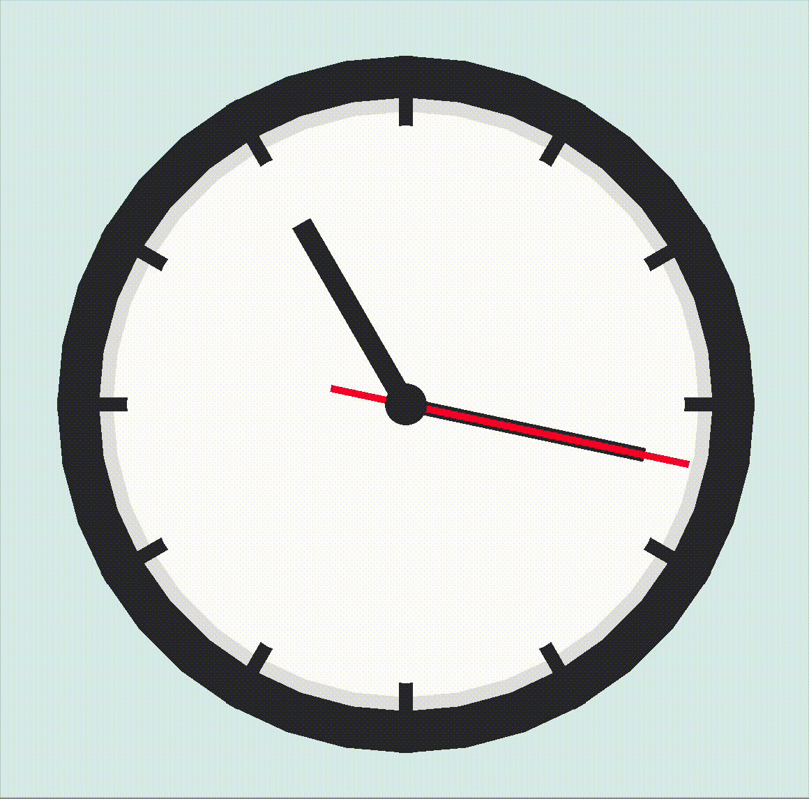

<h1 align="center">█▬▬𒄆 (◡̀_◡́)d𓌏nϟ 𒅒▬▬█</h1>
<h2 align="center">𓂀aᛉlib 🔆</h2>

and Odin bespoke unto thee: " Mortals ⚡ let's plunge y'a into the exciting world of game development harr 💥"

## [𓂀aᛉlib 🔆 basics by Falconerd in Odin](https://github.com/Falconerd/raylib_introduction/blob/master/main.odin)
 1. Create a Window
 2. Draw Simple Shapes
 3. Handle Input
 4. Loading and Drawing Textures
 5. Basic animation
 6. Playing sound
 7. Text rendering
 8. Basic collision detection
 9. Using the camera (2D)
 10. Render Textures, Post Processing Shaders
 11. [Read files](https://odin-lang.org/news/read-a-file-line-by-line/)

## 𓂀aᛉlib 🔆 examples ported to Odin

Voxel space

https://github.com/djmgit/voxel_space/assets/16368427/20eb69ed-96bf-4ddb-a4a2-85214f3da049

Paralax Scrolling
  

Sprite rendering
  

Explosions
  

Animations
  

  
  <h1>Programming With Nick</h1>

Collision detection
  

Menus
  

Analog Clock
  

[Nick's 𓂀aᛉlib 🔆 Tutorial Series on Youtube](https://www.youtube.com/watch?v=wVYKG_ch4yM&list=PLwR6ZGPvjVOSRywn9VCQ3yrRVruxzzuo9)

# Resources

- [Computer Graphics from scratch](https://gabrielgambetta.com/computer-graphics-from-scratch/index.html)
- [Lobster asset packs](https://o-lobster.itch.io/)

𒉭 𐱅𐰇𐰼𐰰 𖣐
