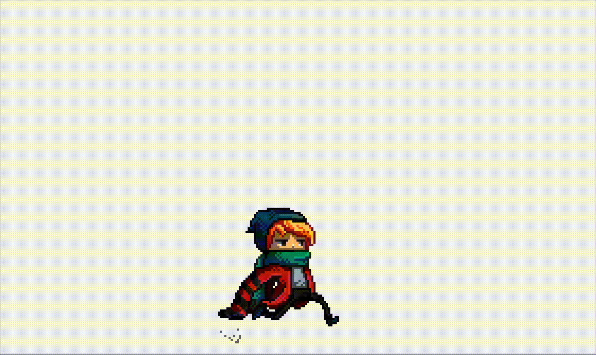
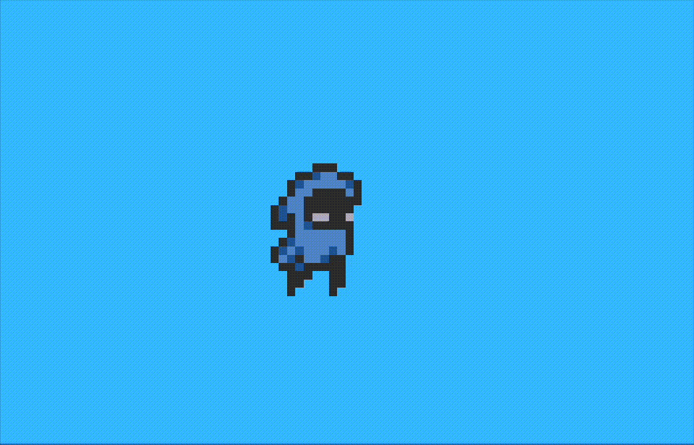
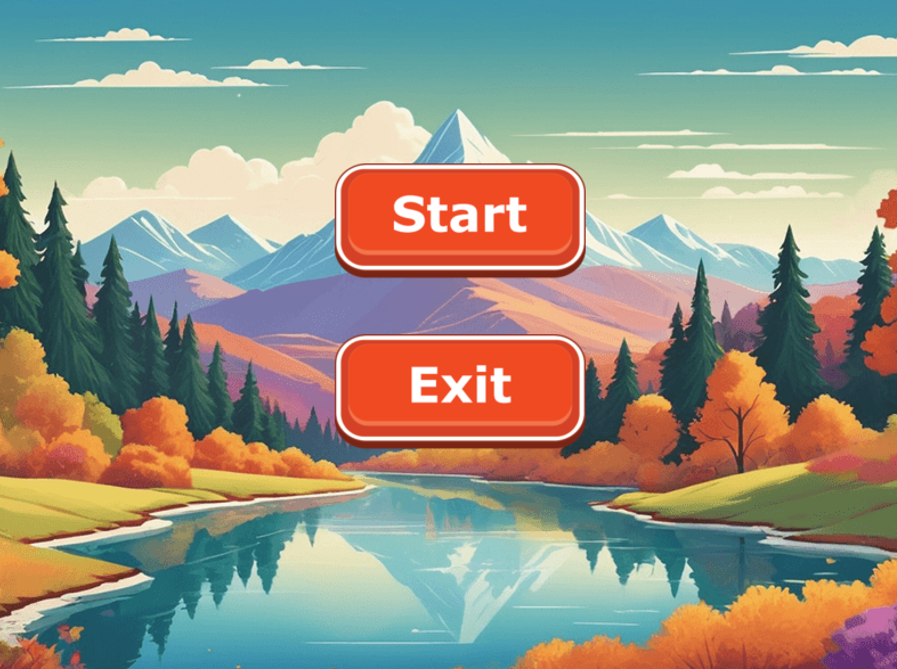

<h1 align="center">█▬▬𒄆 (◡̀_◡́)d𓌏nϟ 𒅒▬▬█</h1>
<h2 align="center">𓂀aᛉlib 🔆</h2>

and Odin bespoke unto thee: " Mortals ⚡ let's plunge y'a into the exciting world of game development harr 💥"

  

  

  

  

  

  

# Resources
## Basic
- [Read file](https://odin-lang.org/news/read-a-file-line-by-line/)
## Sprites
- [Lobster asset packs](https://o-lobster.itch.io/)

𒉭 𐱅𐰇𐰼𐰰 𖣐
