<h1 align="center">█▬▬𒄆 (◡̀_◡́)d𓌏nϟ 𒅒▬▬█</h1>
<h2 align="center">𓂀aᛉlib 🔆</h2>

and Odin bespoke unto thee: " Mortals ⚡ let's plunge y'a into the exciting world of game development, for I bestow upon thee Odin's tongue, to render worlds crisp and beautiful as [Freyja's](https://en.wikipedia.org/wiki/Freyja) hall, handling physics steady as [Mjölnir's](https://en.wikipedia.org/wiki/Mj%C3%B6lnir) flight. No more shall y'a wrestle with the serpents of lake memory or the [Garm](https://en.wikipedia.org/wiki/Garmr) of undefined behavior! Rise now, and build thy games, forge thy digital realm with the strength of [Asgard](https://en.wikipedia.org/wiki/Asgard), for [Odin's language](https://odin-lang.org/docs/examples/) bears the blessing of both low-level mastery and high-level grace...💥"

  <a href="https://gabrielgambetta.com/computer-graphics-from-scratch/index.html">
    Computer Graphics from scratch - Gabriel Gambetta
  </a>
  

## [v5.5 cheat sheet](https://www.raylib.com/cheatsheet/cheatsheet.html)

## [𓂀aᛉlib 🔆 basics by Falconerd](https://github.com/Falconerd/raylib_introduction/blob/master/main.odin)
 1. Create a Window
 2. Draw Simple Shapes
 3. Handle Input
 4. Loading and Drawing Textures
 5. Basic animation
 6. Playing sound
 7. Text rendering
 8. Basic collision detection
 9. Using the camera (2D)
 10. Render Textures, Post Processing Shaders
 11. [𓂀aᛉlib Todo App](https://github.com/scheinheiser/todo-app)

## 𓂀aᛉlib 🔆 2D

  <a href="2D/matrix/basic/main.odin">
    The Matrix
  </a>
  <a href="2D/matrix/basic/main.odin">
    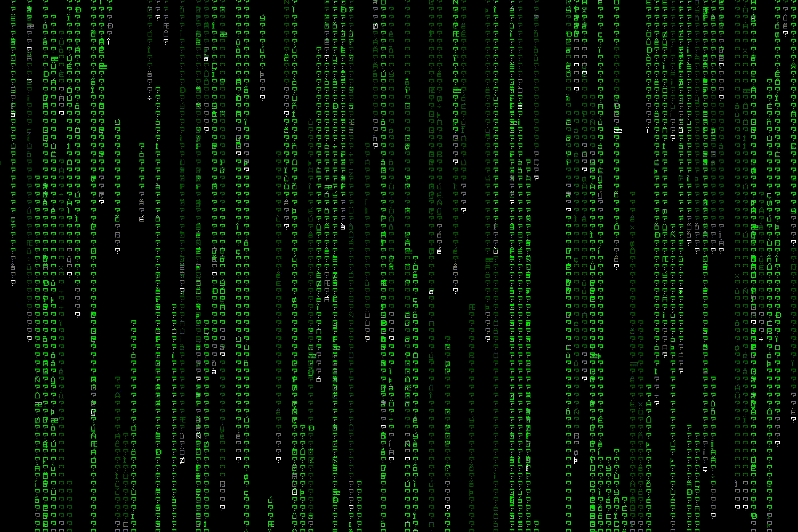
  </a>

  <a href="2D/microui/main.odin">
    MicroUI
  </a>
  <a href="2D/microui/main.odin">
    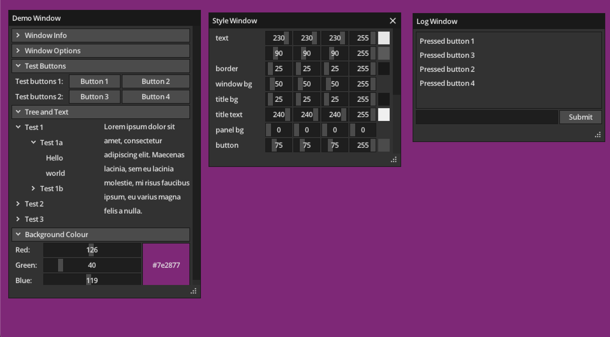
  </a>

  <a href="2D/paralax/scroll.odin">
    Paralax Scrolling
  </a>
  <a href="2D/paralax/scroll.odin">
    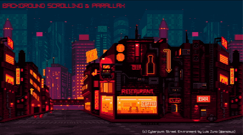
  </a>

  <a href="2D/sprite/basics/basics.odin">
    Sprites
  </a>
  

  <a href="2D/sprite/animator/animator.odin">
    Animator
  </a>
  <a href="2D/sprite/animator/animator.odin">
    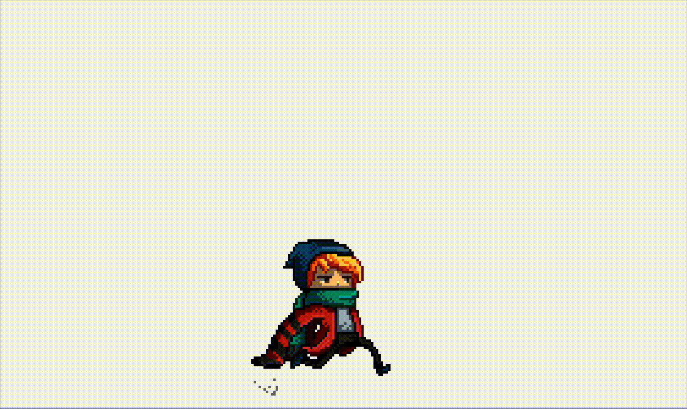
  </a>

  <a href="2D/sprite/jump/main.odin">
    Character Control
  </a>
  

  <a href="2D/camera/main.odin">
    Camera Control
  </a>
  <a href="2D/camera/main.odin">
    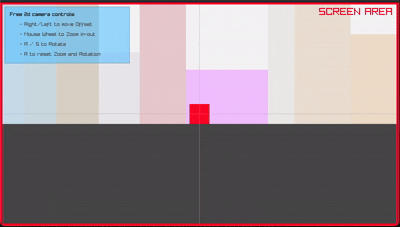
  </a>

  <a href="2D/explosion/explosion.odin">
    Explosions
  </a>
  

The term “sprite” first used by Texas Instruments in the 70s describes independently movable sequences of images used to create the illusion of movement in 2D. They became popular through games like Donkey Kong (1981) and Super Mario Bros (1985)

- [Assimp](https://github.com/CoolDove/odin-assimp/tree/master)

- [Aseprite](https://github.com/blob1807/odin-aseprite)

- [Anima](https://github.com/atomicptr/anima)

- [Lobster asset packs](https://o-lobster.itch.io/)

- [Spriter's Resource](https://www.spriters-resource.com/)

### Physics
Reference implementations for common collision queries and grid navigation

- [Real Time Collision Detection](https://gist.github.com/jakubtomsu/2acd84731d3c2613c91e40c2e064ffe6)
- [Odin's PhysAC](https://github.com/thePHTest/odin-physac/blob/main/physac.odin)
- [A*2D path finding](https://github.com/scoobery/odin_pathgrid/blob/master/README.md)

  <a href="2D/fluid/main.odin">
    Fluid Simulation
  </a>
  

  <a href="2D/racing/main.odin">
    Racing
  </a>
  

[YT Unconventional Coding](https://www.youtube.com/watch?v=0Gxw5HEj784)

  
  <h2>Programming With Nick
  (lessons ported from C++)</h2>

  <a href="2D/collision/dino.odin">
    Collision detection
  </a>
  <a href="2D/collision/dino.odin">
    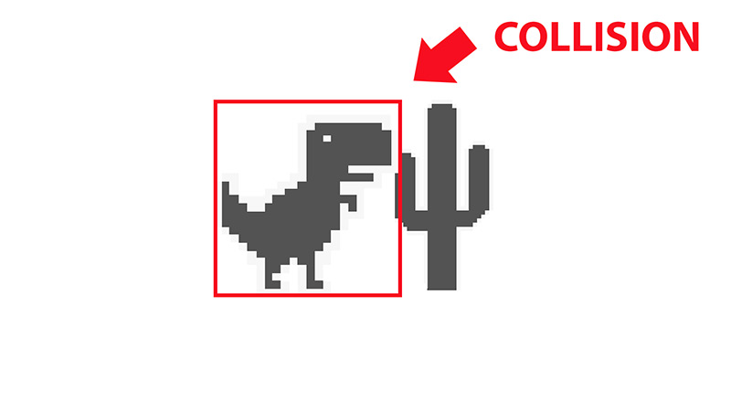
  </a>

  <a href="2D/buttons/button.odin">
    Menus
  </a>
  <a href="2D/buttons/button.odin">
    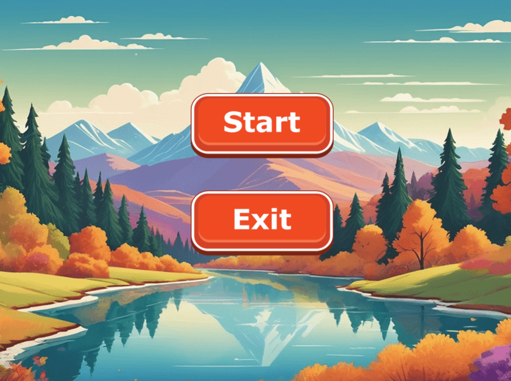
  </a>

  <a href="2D/clock/clock.odin">
    Analog Clock
  </a>
  

  <a href="2D/pong/main.odin">
    Pong
  </a>
  <a href="2D/pong/main.odin">
    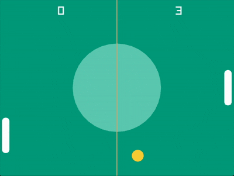
  </a>

  <a href="https://en.wikipedia.org/wiki/Conway's_Game_of_Life">
    Conway's Game of Life
  </a>
  <a href="2D/conway/main.odin">
    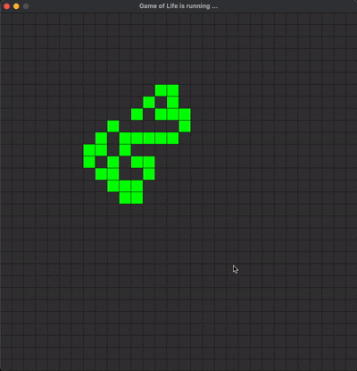
  </a>

[YT Nick's 𓂀aᛉlib 🔆 Tutorials](https://www.youtube.com/watch?v=wVYKG_ch4yM&list=PLwR6ZGPvjVOSRywn9VCQ3yrRVruxzzuo9)

  

## 𓂀aᛉlib 🔆 3D

## OpenGL®
Originally developed by Silicon Graphics in the early '90s, OpenGL® has become the most widely-used open graphics standard in the world

  <a href="3D/gltf/gltf.odin">
    GLTF 3D Models
  </a>
  <a href=3D/gltf/gltf.odin">
    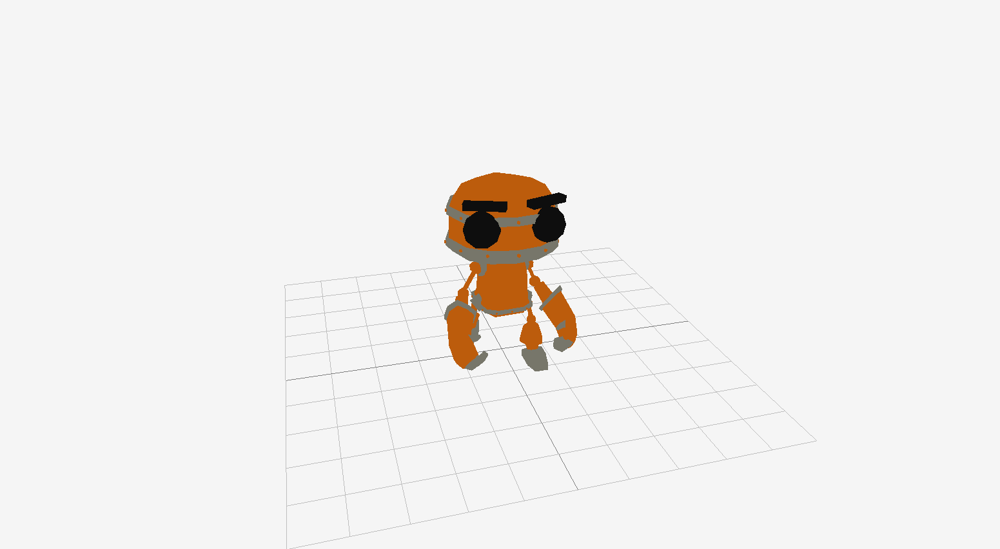
  </a>

- [glTF2](https://github.com/Pawel82S/glTF2) in pure Odin

  <a href="3D/particles/main.odin">
    OBJ 3D Models
  </a>
  <a href="3D/obj/main.odin">
    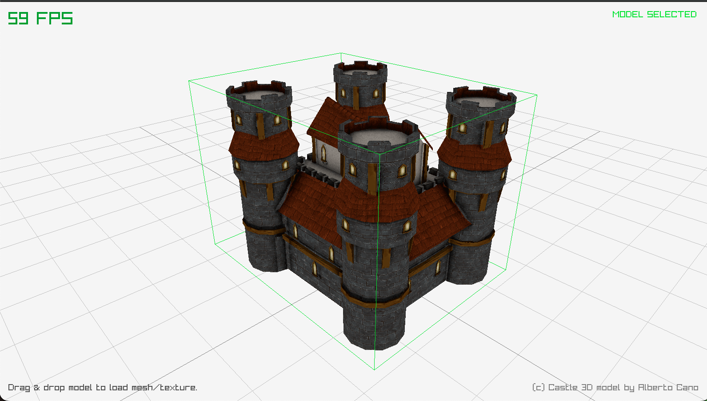
  </a>

- [Hunyuan3D NeuralNet](https://huggingface.co/tencent/Hunyuan3D-2) Image to 3D model
- [Neural network visualizer](https://github.com/bones-ai/odin-mnist-nn) written from scratch in Odin and 𓂀aᛉlib.

  <a href="3D/glsl/main.odin">
    Glsl shaders
  </a>
  

- [Inigo Quilez - ShaderKing](https://iquilezles.org/)
- [Glsl for Beginners](https://waelyasmina.net/articles/glsl-and-shaders-tutorial-for-beginners-webgl-threejs/)
- [Odin's OpenGL® tutorials](https://github.com/bg-thompson/OpenGL-Tutorials-In-Odin)
- [🎨 Shader Tutorials](https://github.com/SuboptimalEng/shader-tutorials)
- [The Book of Shaders](https://thebookofshaders.com/)

### TODO port some more glsl examples ૮( OᴗO)っ Contributions welcome

- [Sirenian Dawn](https://www.shadertoy.com/view/XsyGWV)
- [Blue Planet](https://www.shadertoy.com/view/Ds3XRl)
- [finish particle simulation](particles/README.md)

## SDF

  <a href="2D/sdf/main.odin">
    Karl's SDF Terrain Painter
  </a>
  <a href="2D/sdf/main.odin">
    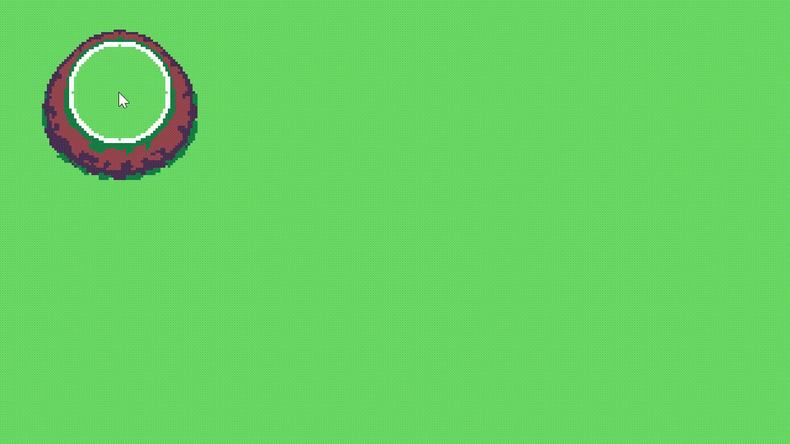
  </a>

- [Intro to Signed Distance Fields](https://www.youtube.com/watch?v=pEdlZ9W2Xs0)

## RayTracing/Casting/Marching

- [Ray Tracing in One Weekend](https://raytracing.github.io/books/RayTracingInOneWeekend.html)
- [Ray Tracing in One Weekend - Code](https://github.com/jmazin/rtow)
- [YT Ray Tracing in an hour! (Part 1)](https://www.youtube.com/watch?v=kHNewYRvgSk)
- [YT Ray Tracing in an hour! (Part 2)](https://www.youtube.com/watch?v=C1tJ0IKLLjw)
- [YT Ray Tracing in an hour! (Part 3)](https://www.youtube.com/watch?v=wXCJgVtcvuM)
- [YT ReSTIR - 600x faster Ray Tracing](https://www.youtube.com/watch?v=gsZiJeaMO48)
- [RIS Paper](https://diglib.eg.org/server/api/core/bitstreams/0205c190-16aa-4f85-a26f-c7b3220683b9/content)
- [RIS Thesis](https://scholarsarchive.byu.edu/cgi/viewcontent.cgi?article=1662&context=etd)
- [Original ReSTIR Paper](https://cdn.pharr.org/ReSTIR.pdf)
- [ReSTIR for Global Illumination Paper](https://d1qx31qr3h6wln.cloudfront.net/publications/ReSTIR%20GI.pdf)
- [Basics of ReSTIR DI](https://blog.42yeah.is/featured/rendering/2023/03/11/restir.html)
- [ReSTIR (C++) with DirectX Raytracing](https://github.com/lindayukeyi/ReSTIR_DX12)
- [ZetaRay (C++) Real-time Direct3D 12 path tracer](https://github.com/alipbcs/ZetaRay)

  <a href="3D/raycasting/dda/main.odin">
    Raycasting
  </a>
  <a href="3D/raycasting/dda/main.odin">
    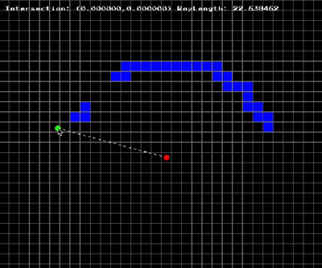
  </a>

- [Super Fast Ray Casting in Tiled Worlds using DDA by OneLoneCoder](https://www.youtube.com/watch?v=NbSee-XM7WA)

  <a href="3D/raycasting/dda/main.odin">
    Raycasting
  </a>
  

- [Making a RayCaster in Odin by Bachware](https://www.youtube.com/watch?v=9dLqxdbRjbM)
- [Alfie's - Odinary 3D DDA Raycaster](https://github.com/alfiehiscox/odinary-raycaster)

  <a href="3D/raymarching/main.odin">
    Raymarching
  </a>
  <a href="3D/raymarching/main.odin">
    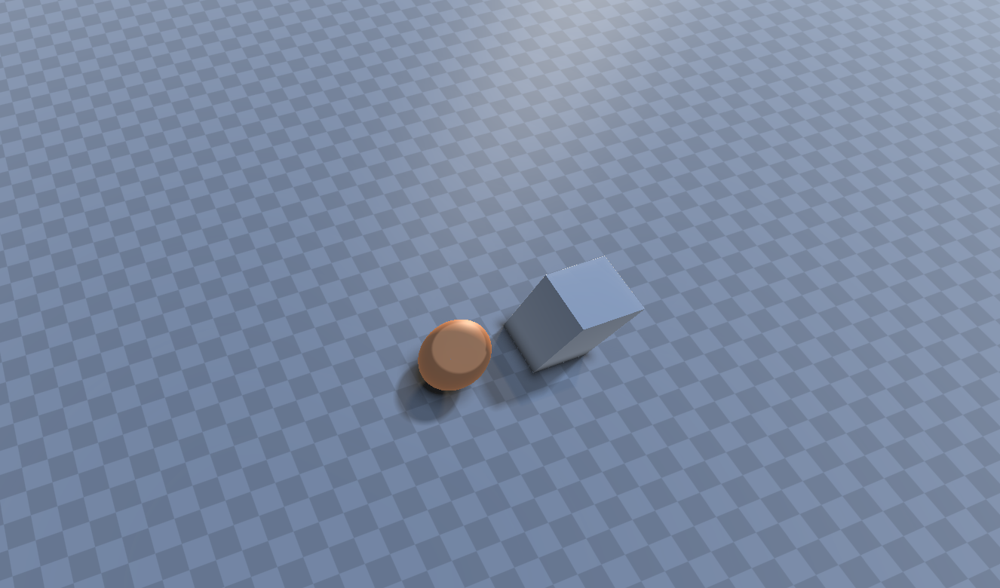
  </a>

- [Michael Walczyk - Raymarching Basics](https://michaelwalczyk.com/blog-ray-marching.html)
- [An introduction to Raymarching](https://www.youtube.com/watch?v=khblXafu7iA)
- [YT Procedural 3D Engine. Ray Marching OpenGL® Tutorial](https://www.youtube.com/watch?v=hUaYxqkrfjA)

  <a href="3D/voxels/README.md">
    Voxel space
  </a>

https://github.com/djmgit/voxel_space/assets/16368427/20eb69ed-96bf-4ddb-a4a2-85214f3da049

- [Voxelisation Algorithms and Data Structures](https://pmc.ncbi.nlm.nih.gov/articles/PMC8707769/)

  <a href="3D/particles/main.odin">
    Particle simulation
  </a>
  

## Physics ૮( OᴗO)っ Contributions welcome

- [PhysX](https://github.com/tgolsson/physx-odin) C Bindings to PhysX

## Audio

- [YT Coding Adventure by Sebastian Lague](https://www.youtube.com/watch?v=iA6wRgwl7k0) Sound (and the Fourier Transform)

- [FFTW](https://github.com/joaocarvalhoopen/FFTW_lib_bindings_for_Odin) C Bindings to compute discrete Fourier transform in one or more dimensions.

- [OpenAl - 3d Audio](https://github.com/elvodqa/odin-al/blob/master/openal.odin) C Bindings

- [FreeSound.org](https://freesound.org/) collaborative collection of ~700K free sounds

- [BBC Sound Effects](https://sound-effects.bbcrewind.co.uk/) 33K free sounds from the BBC Effects archive

## (◡̀_◡́)d𓌏nϟ Hall of FAME

-	[Kenney.nl](https://kenney.nl/assets): Free game assets for 2D and 3D projects.

-	[Quaternius](https://quaternius.com/): Free low-poly 3D models.

-	[OpenGameArt](https://opengameart.org/): A treasure trove of open-source game assets.

- [Dusk's 𓂀aᛉlib game template](https://github.com/JerMakesStuff/Dusk)

- [Karl's 𓂀aᛉlib game template with Hot Reload](https://github.com/karl-zylinski/odin-raylib-hot-reload-game-template)

- [ZTME](https://github.com/Z7-Z7L/ZTME) 𓂀aᛉlib Tile Editor

- [TMX](https://github.com/RobLoach/raylib-tmx) Load Tiled .tmx files for tile maps in 𓂀aᛉlib, with TMX C Loader.

## [Contribute](contributing.md)
Enter thy hall, where mortals become legends and etch your legacy into the fabric of [Yggdrasil](https://en.wikipedia.org/wiki/Yggdrasil) itself

𒉭 𐱅𐰇𐰼𐰰 𖣐

