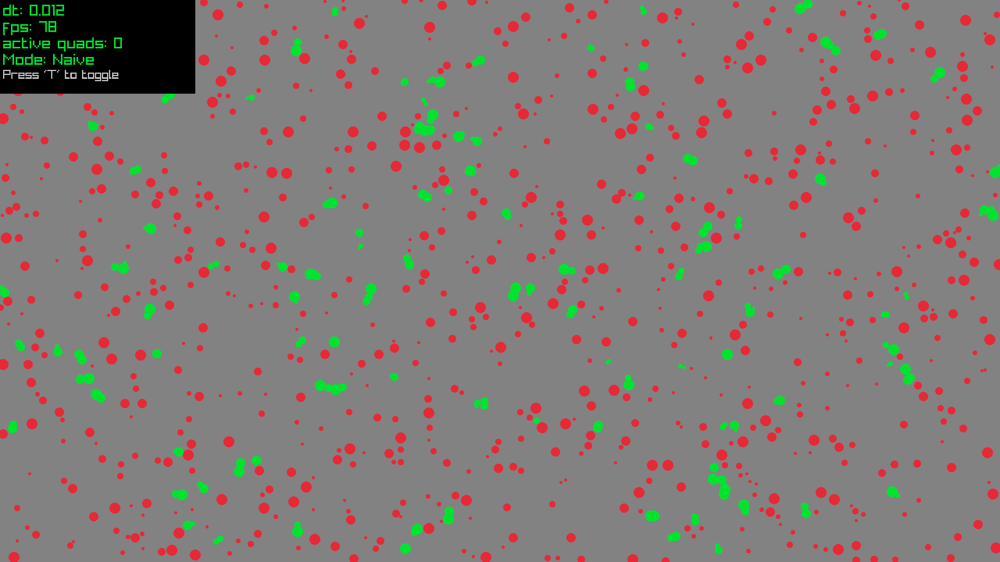
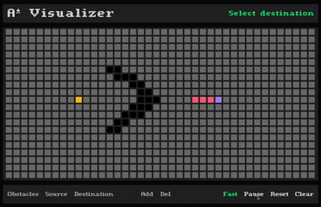
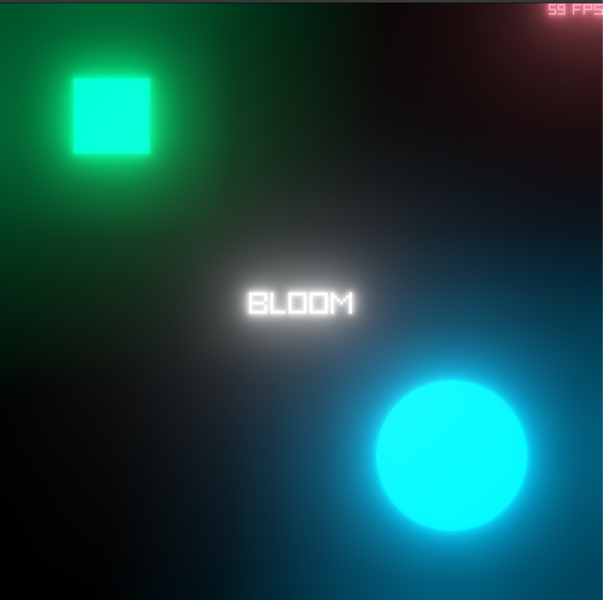
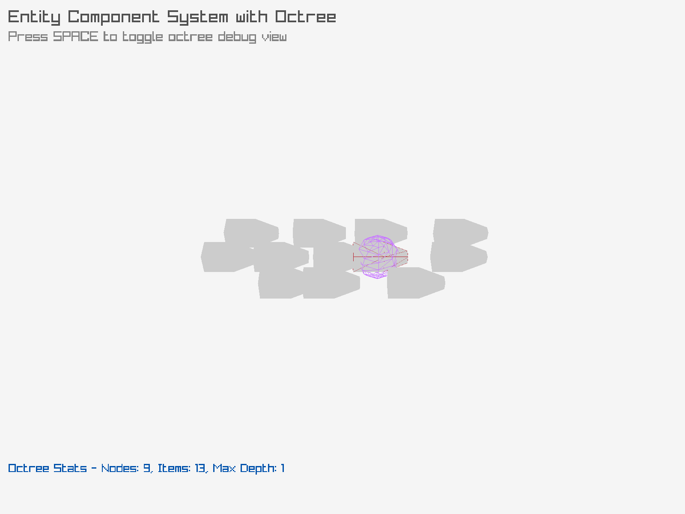
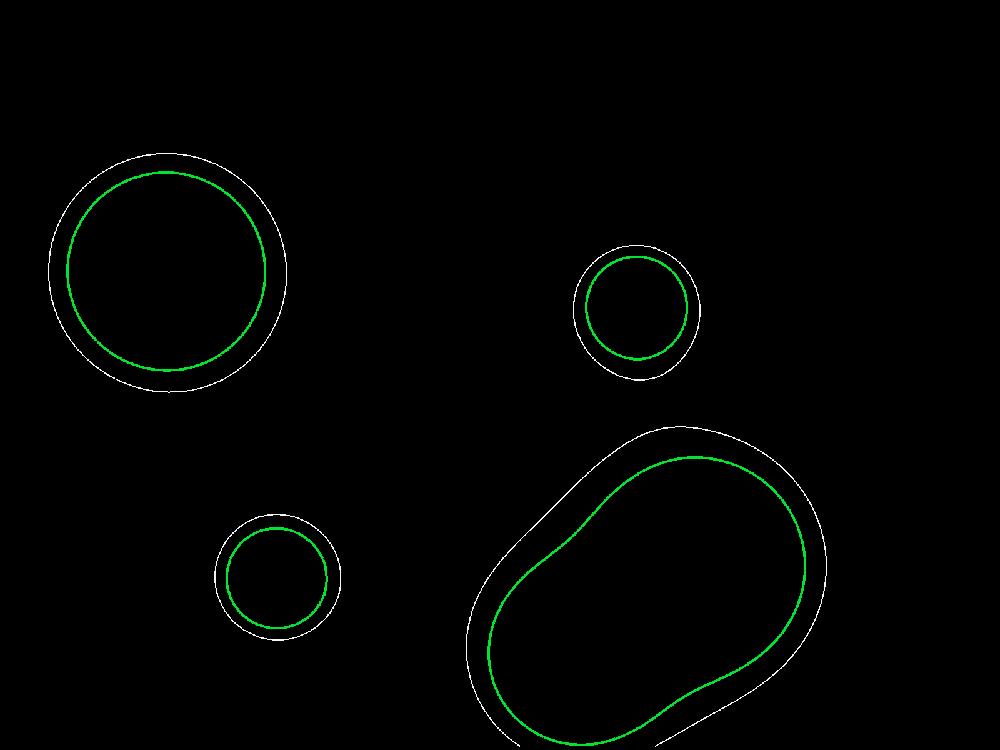
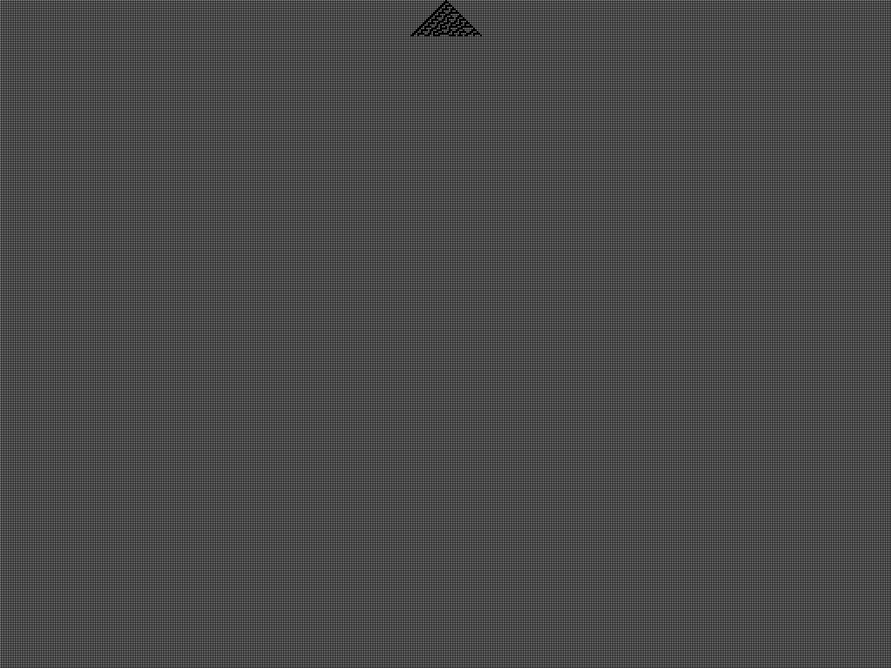

### [Algorithms by Jeff Erickson](https://jeffe.cs.illinois.edu/teaching/algorithms/)

1. **Quadtree**

  

Quadtree stands out as a pivotal data structure, especially in 2D game development. It excels at spatial partitioning, efficiently organizing and searching for objects in a hierarchical tree structure. This enhances critical aspects such as collision detection and rendering, contributing to smoother gameplay experiences.

2. **Octree**

Extending the concept of the quadtree into three-dimensional space, the octree is a crucial asset for 3D game development. It efficiently organizes and queries objects within a three-dimensional environment, proving indispensable for managing complex scenes and optimizing rendering processes.

3. **(A Star) Algorithms**

  

A* is a versatile pathfinding algorithm that serves as the backbone for determining optimal paths between points in game environments. Its applications range from ensuring intelligent NPC movement to facilitating efficient player navigation, enhancing overall gameplay and user experience.

4. **Bit-Matrix Transpose**

  

Optimized algo to transpose a square bit-matrix, by swapping bits across top-right to bottom-left diagonally.
Taking advantage of [Binary Code Modulation](http://www.batsocks.co.uk/readme/art_bcm_1.htm). This technique allows the value of a cpu register to control the duty-cycle. Only requiring a single hardware timer to control multiple outputs. Super fast and efficient.

5. **Bloom**

  

[Next Generation Post Processing in Call of Duty](https://www.iryoku.com/next-generation-post-processing-in-call-of-duty-advanced-warfare/) by Jorge Jimenez introduced a type of [Physics Based Bloom](https://learnopengl.com/Guest-Articles/2022/Phys.-Based-Bloom) that is both computationally efficient and looks really good for most use-cases.

6. **Collision Detection Algorithms**

Various collision detection algorithms such as Separating Axis Theorem (SAT) and Gilbert–Johnson–Keerthi (GJK) are fundamental for realistic interactions between game entities. They are crucial for detecting and resolving collisions, ensuring accurate and engaging gameplay.

7. **Entity Component System**

  

8. **Flood Fill** 

9. **Marching Squares**

  

10. **Rule 30**

  

11. **Wave Function Collapse** 
WFC (Wave Function Collapse) is a type of PCG (Procedural Contents Generation) algorithm that analyzes the connectivity patterns of source material to generate output with identical connectivity relationships. Texture Synthesis is the general term for this technique, which creates large result images from small source images.

[Nurikabe Map Generation with WFC algorithm](https://sublevelgames.github.io/blogs/2025-06-22-nurikabe-map-gen-with-wfc/) Captcha solver