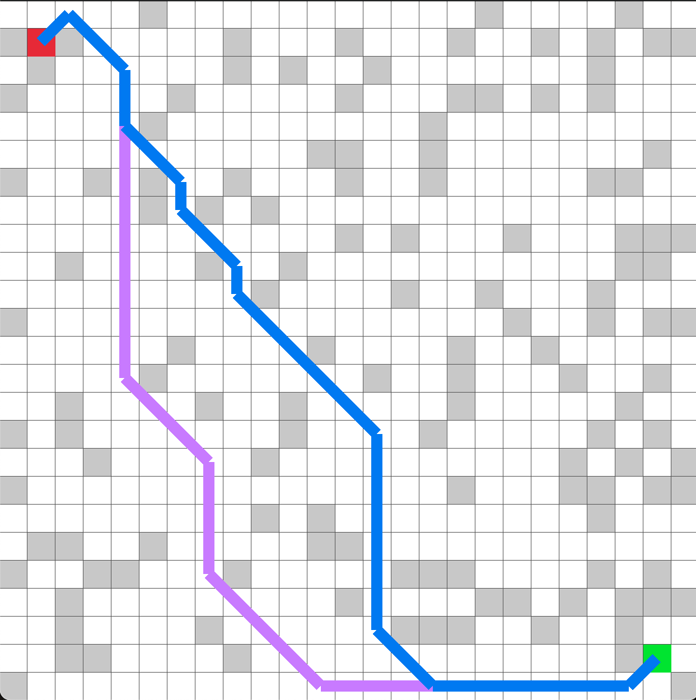

## A* path finder

  <a href="naive/main.odin">
    Naive
  </a>
  

  <a href="jump/demo/main.odin">
    Jump
  </a>
  

- [Pathfinding](https://juhrjuhr.itch.io/deep-space-exploitation/devlog/945428/9-pathfinding)

## Todo
- [D* Lite Pathfinding](https://github.com/RodrigoJara25/algortimo-dijkstra-d-star-lite-lp/blob/main/cpp/main.cpp)

## Reference

- [The hidden beauty of the A* algorithm](https://www.youtube.com/watch?v=A60q6dcoCjw)
- [Johnson's algorithm](https://en.wikipedia.org/wiki/Johnson%27s_algorithm)
- [Jump Point Search](https://zerowidth.com/2013/a-visual-explanation-of-jump-point-search/)
