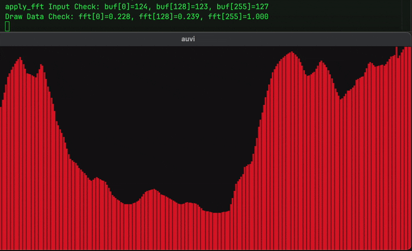

<p align="center">
    <a href="2D/games/life/main.odin">
        Fast Fourier Transform
    </a>
    <a href="fft.odin">
        
    </a>
</p>

For windows use the official lib: https://www.openal.org/downloads/

For linux or macOS use the soft-port: https://openal-soft.org/#download

```bash
cd openal-soft-1.24.2/build
cmake ..
cmake --build .
cp libopenal.1.dylib ../../
cd ...
odin run .
```

- [OpenAL Programmers Guide](http://openal.org/documentation/OpenAL_Programmers_Guide.pdf)

- [OpenAL 3D Sound Tutorial](https://rastertek.com/gl4linuxtut57.html)
