# Inverse Kinematics Simulation

1. **Chain**

  <a href="chain/main.odin">
    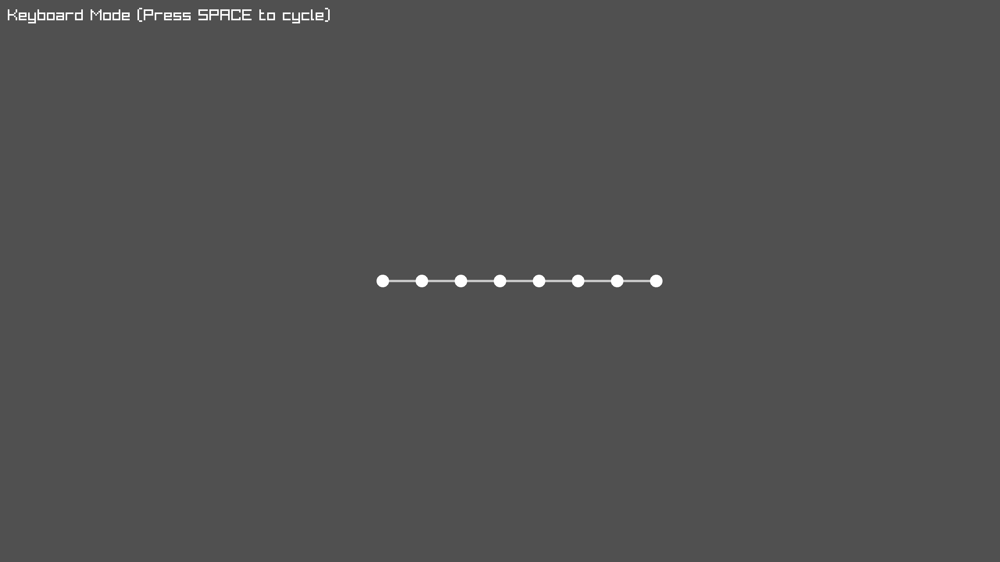
  </a>

2. **Rope**

  <a href="rope/main.odin">
    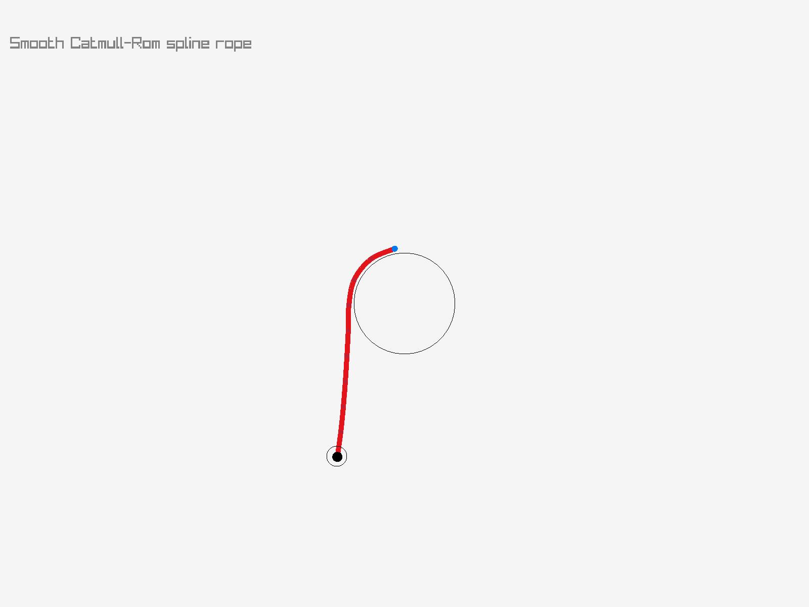
  </a>

3. **Zoo**

  <a href="zoo/main.odin">
    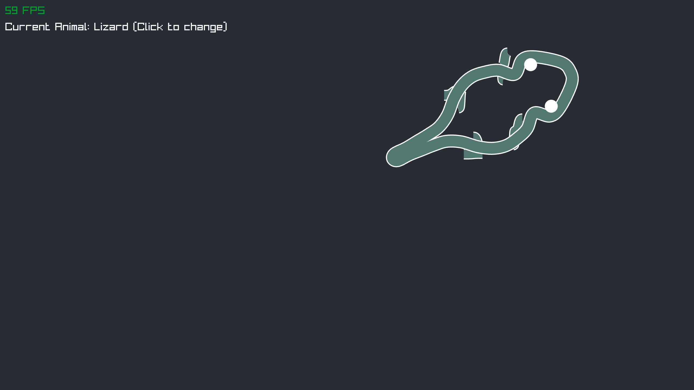
  </a>
    <a href="zoo/main.odin">
    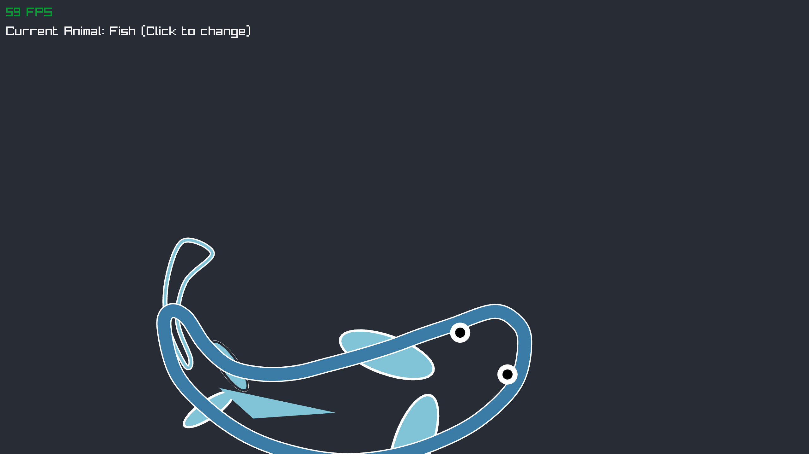
  </a>
  <a href="zoo/main.odin">
    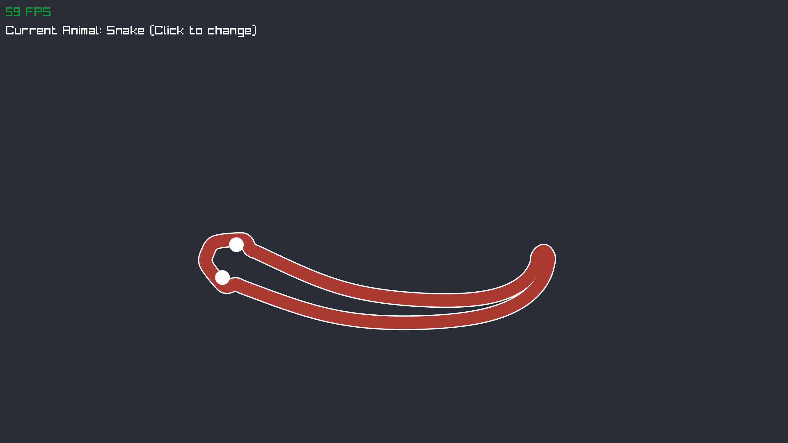
  </a>

4. **Snake**

  <a href="snake/main.odin">
    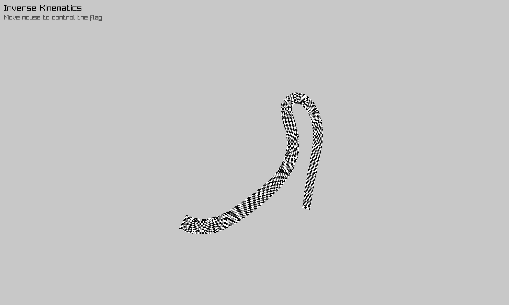
  </a>

5. **Tentacle**

  <a href="tentacle/main.odin">
    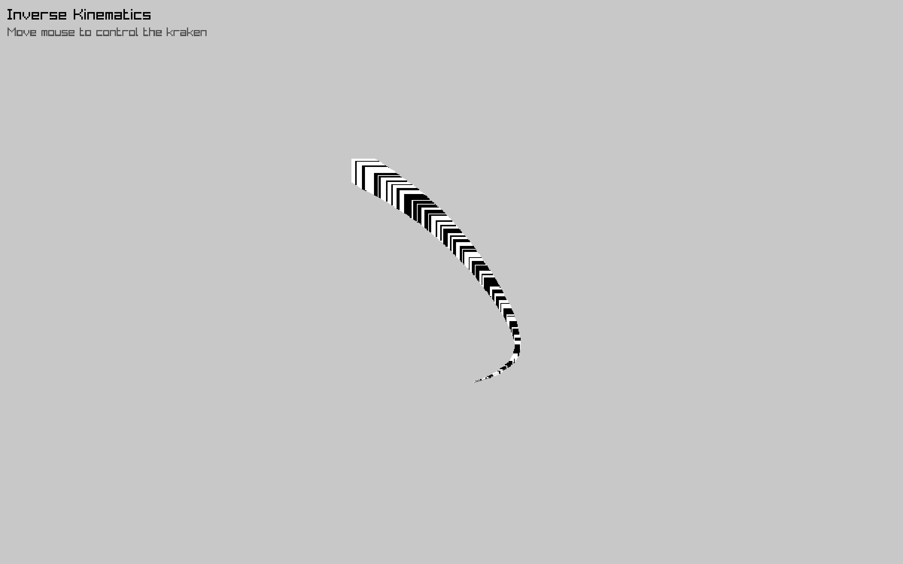
  </a>

6. **Repulsion**

  <a href="repulsion/main.odin">
    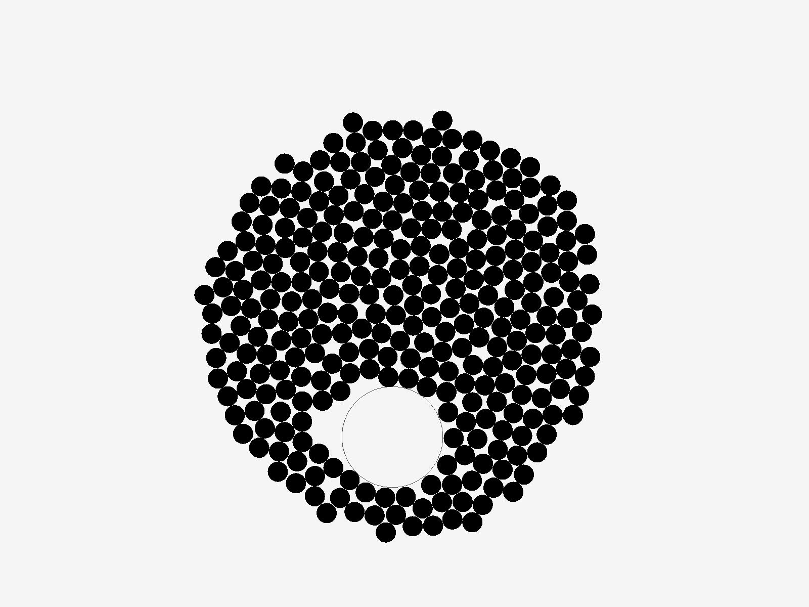
  </a>

7. **Tumbler**

  <a href="tumbler/main.odin">
    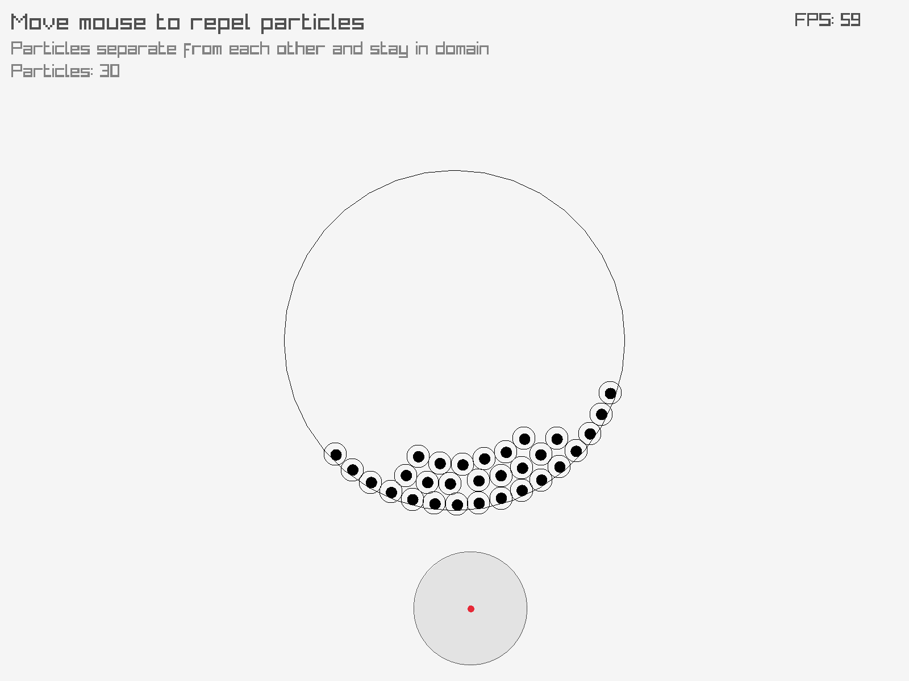
  </a>

8. **Fabrik**

  <a href="fabrik/2D/main.odin">
    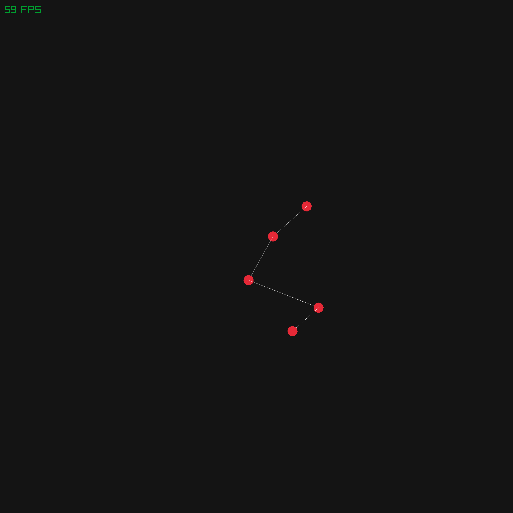
  </a>
  <a href="fabrik/3D/main.odin">
    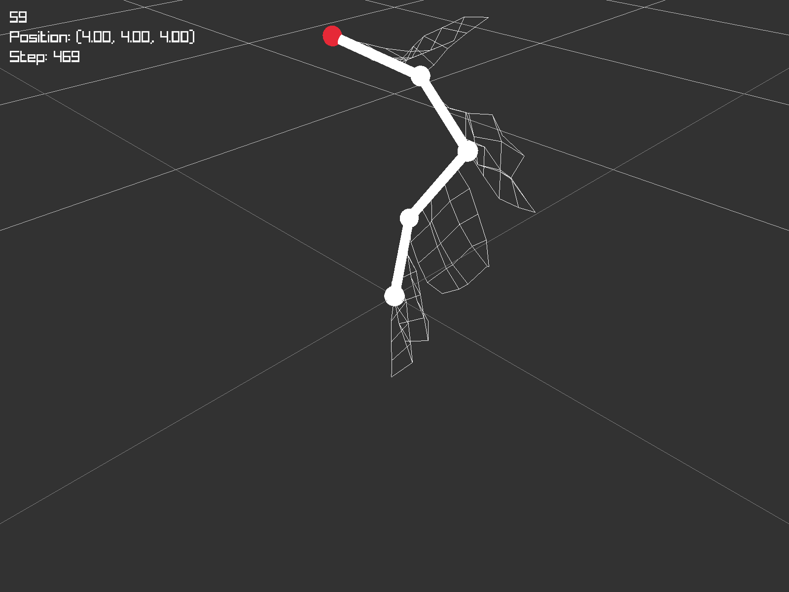
  </a>
  <a href="fabrik/cloth/main.odin">
    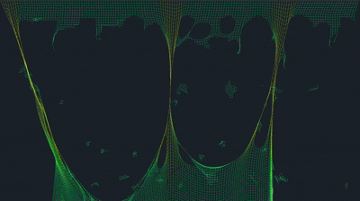
  </a>

